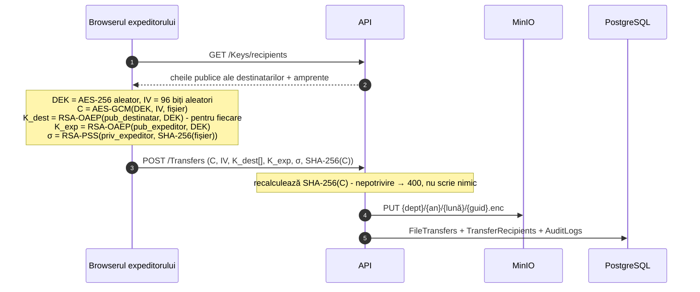
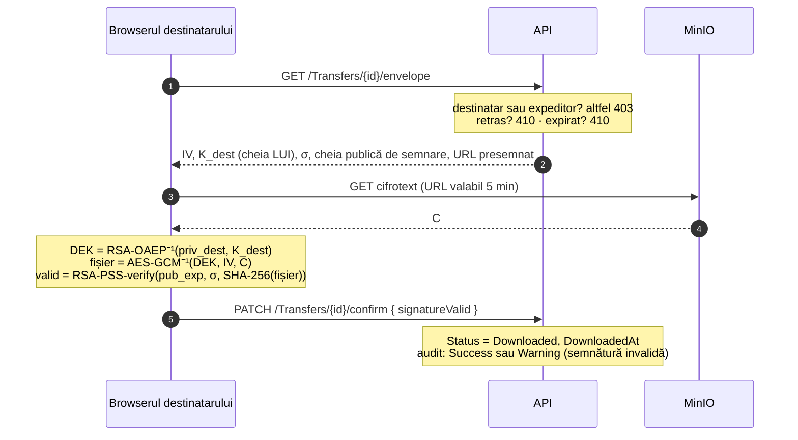
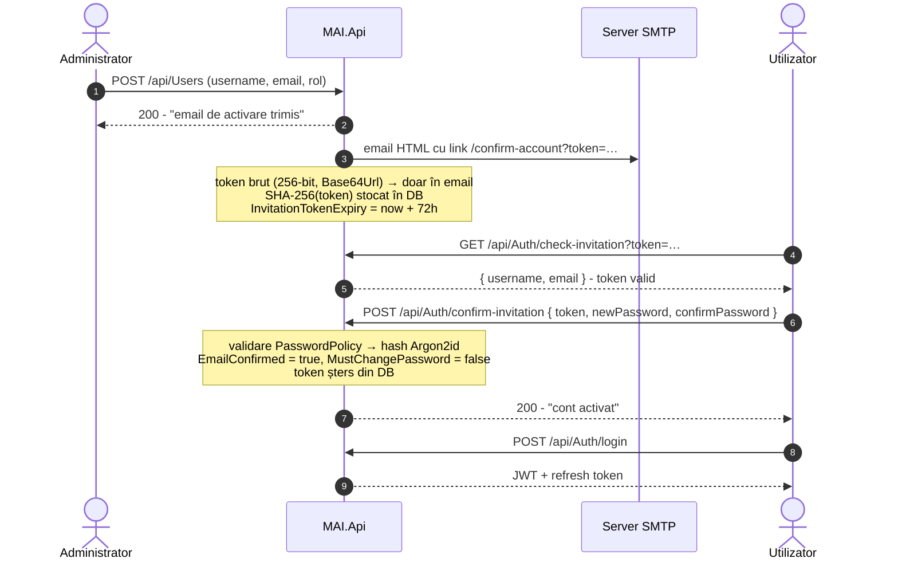

# SGDM - Sistem de Gestiune a Documentelor și Transferurilor Securizate

Platformă de intranet pentru **Ministerul Afacerilor Interne al Republicii Moldova**.
Angajații își trimit documente criptate **end-to-end**, iar serverul care le
transportă și le stochează **nu le poate citi**.

**Stack:** .NET 8 (ASP.NET Core, EF Core) · React 19 + TypeScript · PostgreSQL 17
· MinIO (S3 auto-găzduit) · nginx · WebCrypto API în browser. Totul rulează în
Docker, în intranet; nicio componentă nu depinde de un serviciu extern.
**Proiect de practică** - UTM FCIM, Securitate Informațională, 2026.

> Document pentru **evaluare**: ce face sistemul, cum funcționează și de ce a
> fost proiectat astfel. Pentru instalare: [`docs/DEPLOYMENT.md`](docs/DEPLOYMENT.md).

---

## Cuprins

1. [Pe scurt, pentru comisie](#1-pe-scurt-pentru-comisie)
2. [Arhitectura sistemului](#2-arhitectura-sistemului)
3. [Funcționalități implementate](#3-funcționalități-implementate)
4. [Criptarea end-to-end: cine ce cheie deține și când](#4-criptarea-end-to-end-cine-ce-cheie-deține-și-când)
5. [Autentificare, sesiuni, autorizare](#5-autentificare-sesiuni-autorizare)
6. [Deciziile de arhitectură și de ce](#6-deciziile-de-arhitectură-și-de-ce)
7. [Calitate: teste, CI, loguri, audit](#7-calitate-teste-ci-loguri-audit)
8. [Structura repository-ului](#8-structura-repository-ului)

---

## 1. Pe scurt, pentru comisie

**Modelul de amenințare.** Serverul este tratat ca **onest dar curios**: execută
corect protocolul, dar tot ce stochează poate ajunge, la un moment dat, pe mâna
cuiva care nu ar trebui - un administrator de bază de date, un backup scurs, un
atacator care a obținut acces la MinIO. Sistemul e construit astfel încât în
acest scenariu conținutul fișierelor să rămână **confidențial**, iar orice
alterare să fie **detectată**.

**Ce garantează sistemul și prin ce mecanism:**

| Proprietate | Mecanism | Cine verifică |
|---|---|---|
| Confidențialitate | AES-256-GCM cu cheie aleatorie per transfer, împachetată RSA-OAEP-3072 | Nimeni în afara capetelor nu are cheia |
| Integritate conținut | Tag-ul de autentificare GCM (128 biți) | Browserul destinatarului; decriptarea eșuează dacă e alterat |
| Autenticitatea expeditorului | Semnătură RSA-PSS-3072 peste SHA-256 al conținutului | Browserul destinatarului, cu cheia publică de semnare |
| Integritatea încărcării | SHA-256 al cifrotextului declarat de client, recalculat pe server | Serverul, înainte de a scrie în MinIO |
| Integritatea documentelor normative | SHA-256 calculat la publicare, trecut în registru | Browserul la descărcare |
| Trasabilitate completă | Jurnal de audit cu `Success / Warning / Failure`, exportabil în Excel | Administrator și Șef de direcție |

**Unde să vă uitați în cod, în ordinea asta:**

1. [`frontend/src/crypto/E2ee.ts`](frontend/src/crypto/E2ee.ts) - toată
   criptografia, ~300 de linii efective, comentate complet.
2. [`MAI.Api/Controllers/TransfersController.cs`](MAI.Api/Controllers/TransfersController.cs)
   - ce face serverul cu un transfer (și ce nu face - nu vede conținutul).
3. [`MAI.Api/Program.cs`](MAI.Api/Program.cs) - configurarea de securitate și
   validările care opresc pornirea cu configurație nesigură.
4. [`MAI.Tests/`](MAI.Tests/) - ce este verificat automat la fiecare push.

---

## 2. Arhitectura sistemului


Backend-ul e organizat pe straturi cu o singură direcție de dependență:

| Proiect | Rol | Depinde de |
|---|---|---|
| `MAI.Domain` | Entități și enumerări. Zero logică, zero dependențe. | - |
| `MAI.DataAccessLayer` | `AppDbContext`, configurări EF, migrări versionate | Domain |
| `MAI.BusinessLogic` | Argon2id, TOTP, politica de parole, stocare fișiere, E-mail | Domain |
| `MAI.Api` | Controllere, middleware, servicii de sesiune și token, job-uri | toate |
| `MAI.Tests` | Teste unitare și de arhitectură (xUnit, fără bază de date) | Api, BusinessLogic, Domain |

Toate componentele stau în intranet. Până pe 22 septembrie 2026 baza de date
era pe Supabase (cloud); a fost mutată în Docker tocmai pentru că modelul de
amenințare de mai sus presupune că nimic nu iese din instituție: conturile,
jurnalul de audit și metadatele transferurilor nu au ce căuta pe un server
extern. Mutarea s-a făcut cu instrumentul de backup, cu verificare rând cu rând
(`docs/DEPLOYMENT.md`, secțiunea 7.3).

În modul publicat, browserul vorbește doar cu nginx, iar cifrotextul trece prin
API. În modul de dezvoltare, API-ul emite un URL temporar semnat (5 minute) spre
MinIO, iar browserul descarcă direct. Motivarea: D7 și D11.

---

## 3. Funcționalități implementate

### 3.1 Transferuri securizate E2EE

- **Trimitere** cu criptare AES-256-GCM + ampachetare RSA-OAEP-3072 și
  semnătură RSA-PSS-3072, integral în browser.
- **Destinatari multipli** - același fișier se împachetează pentru fiecare
  destinatar ales, stocat în tabelul `TransferRecipients`; fiecare destinatar
  vede și poate decripta doar propria copie a cheii.
- **Retransmitere** - expeditorul poate retrimite din propria copie a DEK-ului.
- **Dovadă de primire** - browserul destinatarului raportează dacă semnătura
  expeditorului este validă la deschidere; o semnătură invalidă apare ca
  `Warning` în jurnal și în panoul de alerte al administratorului.
- **Retragere transfer** - expeditorul poate retrage un fișier; cifrotextul se
  șterge din MinIO, rândul rămâne marcat `Retras` cu motiv și cu marcaj de timp.
- **Categorii**: fiecare transfer se clasifică drept `Important`, `General` sau
  `Obișnuit`, filtrat în interfață.
- **Expirare configurabilă**: termenul de valabilitate e setat per transfer
  (implicit 7 zile); un job de fundal rulează la fiecare 15 minute și curăță
  transferurile expirate.

### 3.2 Registru normativ de documente

- Publicare cu versionare: fiecare versiune are SHA-256 calculat și stocat;
  browserul îl reverifică la descărcare.
- Descărcarea oricărei versiuni anterioare cu trasabilitate completă în audit.
- Documentele normative **nu sunt criptate E2EE** - sunt acte publice intern,
  accesibile tuturor angajaților cu căutare pe server.

### 3.3 Gestionarea conturilor și invitații

- **Creare cont cu invitație prin email**: la crearea unui cont cu adresă de
  email, se generează un token criptografic (256 biți, SHA-256 în baza de date),
  se trimite un email HTML cu link de activare valabil 72 de ore. Utilizatorul
  deschide linkul, vede o pagină dedicată și își setează propria parolă (validată
  prin politica de parole + Argon2id). Contul este blocat la autentificare până
  la confirmare.
- **Retrimitere invitație** de către administrator dacă linkul a expirat sau
  emailul nu a ajuns.
- **Schimbare parolă forțată**: conturile create de administrator (fără email sau
  după resetare) sunt marcate `MustChangePassword = true`; interfața cere
  obligatoriu o parolă proprie la prima autentificare.
- **Gestionare sesiuni per dispozitiv**: fiecare autentificare deschide o sesiune
  separată cu IP, user-agent și ultima activitate, vizibilă și revocabilă din
  profil.
- **Resetare parolă administrativă**: administrator poate seta o parolă
  temporară; utilizatorul este forțat să o schimbe la autentificare.
- **Activare / dezactivare cont** cu revocare imediată a tuturor sesiunilor.
- **Modificare rol** cu revocare de sesiuni și validări de gardă (ultimul
  administrator nu poate fi retrogradat).

### 3.4 Notificări email (SMTP / MailKit)

- Email de **invitație** la crearea contului - template HTML cu antet MAI.
- Email de **notificare transfer primit** - expeditor, nume fișier, dată expirare.

### 3.5 Securitate multi-strat

| Mecanism | Detalii |
|---|---|
| Hash parole | Argon2id, format PHC, pepper extern, două profiluri de cost (Interactive / Sensitive) |
| Protecție DoS Argon2 | Semafor cu maxim 4 hash-uri simultane; depășit → 503 + `Retry-After` |
| Politica de parole | Lungime, clase de caractere, interzicere username în parolă, listă de parole banale |
| Blocare cont | Progresivă, exponențială: 5 eșecuri → 5 min, dublu până la 8 h |
| Rate limiting | Per IP, pe categorii: login, refresh, operații cu parola, upload |
| 2FA TOTP (RFC 6238) | Secret cifrat, fereastră de ±1 interval, reprotecție anti-replay, 10 coduri de recuperare |
| 2FA obligatoriu pe roluri privilegiate | `PrivilegedMfaFilter` verifică `amr = mfa` pe endpoint-urile de administrator |
| Confirmare email | Token aleatoriu 256-bit, SHA-256 în DB, expiry 72 h, blocare login până la activare |
| Unicitate conturi | Username și email unice fără diferență de majuscule (indexuri pe `lower(...)`) |
| Antet criptografic | CSP, `nosniff`, `X-Frame-Options: DENY`, `Referrer-Policy`, HSTS pe HTTPS |
| Perimetru intranet | Middleware care respinge IP-urile din afara plajelor configurate (dezactivat implicit, cu mod audit pentru rodaj) |
| Refuz configurație nesigură | Pornirea eșuează explicit dacă lipsesc secretele sau există valori-șablon (`YOUR_…`) |

### 3.6 Jurnal de audit și rapoarte

- Fiecare operație (autentificare, transfer, descărcare, modificare rol, etc.)
  produce un rând cu `UserId`, `Username`, `Action`, `Details`, `Result`
  (`Success / Warning / Failure`) și `CreatedAt`.
- Filtru pe acțiune, rezultat, utilizator, interval de timp.
- Export în **XLSX** și **CSV** direct din interfață.
- **Alerte de securitate** pe `/admin`: autentificări eșuate repetate, coduri
  de recuperare 2FA folosite, semnături invalide la descărcare, conturi
  privilegiate fără 2FA activat.
- **Rapoarte grafice**: transferuri pe zi, distribuție pe categorii, utilizatori
  activi - alimentate de `StatsController`.

---

## 4. Criptarea end-to-end: cine ce cheie deține și când

### 4.1 Inventarul cheilor

| Cheie | Unde se naște | Unde stă | Cine o are în clar | Cât trăiește |
|---|---|---|---|---|
| **Parola** utilizatorului | Tastatura | Pe server doar hash Argon2id + pepper | Utilizatorul; serverul, pe durata cererii de login | Până la schimbare |
| **KEK** - cheia de împachetare (AES-256, PBKDF2-SHA256, 600.000 iterații) | Browser, derivată din parolă + salt | Nicăieri | Browserul, doar pe durata descuierii | Secunde |
| **Pereche RSA-OAEP-3072** (criptare) | Browser, la prima autentificare | Publică: `Users.PublicKeyEncryption`. Privată: în blobul criptat cu KEK | Privată: doar tabul titularului, **non-extractable** | Până la resetarea contului |
| **Pereche RSA-PSS-3072** (semnare) | La fel | La fel | La fel | La fel |
| **DEK** - cheia de fișier (AES-256-GCM) | Browserul expeditorului, per transfer | Doar împachetată, pentru fiecare destinatar și pentru expeditor | Expeditorul la trimitere, destinatarul la deschidere | Cât transferul |
| Secret **TOTP** | Server | `Users.TwoFactorSecret`, cifrat AES-GCM cu `MAI_TWOFACTOR_KEY` | Serverul (necesar pentru verificarea codului) | Până la dezactivare |
| **Refresh token** (512 biți aleatori) | Server | În `UserSessions` doar SHA-256; în clar în browser | Browserul | 7 zile, rotit la fiecare folosire |
| **Token invitație** (256 biți aleatori) | Server, la creare cont | SHA-256 în `Users.InvitationToken`; tokenul brut doar în email | Nimeni după trimitere | 72 ore |
| **Cheia JWT**, **pepper-ul Argon2**, **cheia 2FA** | Operatorul (`openssl rand`) | Variabile de mediu, niciodată în Git | Procesul API | Până la rotire |

Serverul nu deține, în niciun moment, nimic care să îi permită să deschidă un
fișier: are cheile publice (care criptează), blob-uri încuiate cu parole pe care
nu le stochează și DEK-uri împachetate cu chei private pe care nu le are.

### 4.2 Prima autentificare: generarea cheilor


Parola de confirmare (pasul 6) garantează că cheile nu vor fi încuiate cu o
parolă greșită - ceea ce ar produce pierdere definitivă a accesului la fișiere.

### 4.3 Trimiterea unui fișier



### 4.4 Primirea și dovada de primire



### 4.5 Schimbarea parolei

Cheile private sunt încuiate cu parola. Schimbarea parolei fără reîmpachetarea
blobului ar face toate fișierele primite inaccesibile. Ordinea garantează că
nicio eroare parțială nu produce pierdere de date:

1. Browserul descuie blobul cu parola **veche** și îl reîncuie cu cea **nouă**.
   Dacă parola veche e greșită, se oprește - nimic nu s-a modificat.
2. `PATCH /Auth/change-password` - schimbă hash-ul și închide toate sesiunile.
3. `PATCH /Keys/rewrap` - trimite blobul nou, parola nouă verificată de server.

---

## 5. Autentificare, sesiuni, autorizare

| Mecanism | Implementare | Parametri |
|---|---|---|
| Hash parole | Argon2id + pepper, format PHC, două profiluri de cost | Interactive: 19 MiB, t=2. Sensitive (admin): 64 MiB, t=3 |
| Confirmare email la creare cont | Token 256-bit (SHA-256 în DB), link valabil 72 h, login blocat până la activare | Retrimitere disponibilă din panoul de administrare |
| Schimbare parolă forțată | `MustChangePassword = true` la creare fără email sau după resetare; serverul refuză `POST /Keys` până la schimbare | Validat și pe server, nu doar în UI |
| Politica de parole | Lungime, clase, interzicere username, listă parole banale | Minim 12 caractere, verificat prin `PasswordPolicy` |
| Blocare cont | Progresivă, exponențială, blocări noi nu închid sesiunile existente | 5 eșecuri → 5 min, dublu până la 8 h |
| Rate limiting | Ferestre fixe per IP, per categorie de endpoint | Login 10/5 min · Refresh 30/min · Parole 5/15 min |
| 2FA TOTP (RFC 6238) | Secret cifrat AES-GCM; token de provocare opac (nu JWT); anti-replay pe `TwoFactorLastUsedStep` | 30 s, ±1 fereastră; 10 coduri de recuperare unice |
| 2FA pe roluri privilegiate | `PrivilegedMfaFilter` pe endpointurile cu rol ≥ Șef direcție, verifică `amr = mfa` în JWT | Activabil din `TwoFactor:RequiredForPrivilegedRoles` |
| Token de acces | JWT HS256, issuer și audience validate, `ClockSkew = 0` | 15 minute |
| Sesiuni | Per dispozitiv (`UserSessions`), refresh token opac rotit, stocat SHA-256 | 7 zile, vizibil și revocabil din profil |
| Autorizare | Roluri declarate explicit pe fiecare endpoint, verificate automat în CI | Utilizator (1) · Șef direcție (2) · Administrator (3) |
| Unicitate conturi | Username și email unice, fără diferență de majuscule | Indexuri pe `lower(...)`, email opțional |
| Perimetru | Middleware intranet-only pe plaje IP configurate | Dezactivat implicit; mod `AuditOnly` pentru rodaj |
| Antete de securitate | CSP, `nosniff`, `X-Frame-Options`, `Referrer-Policy`, HSTS | Pe toate răspunsurile API inclusiv 403 și 429 |

### Fluxul de invitație - detaliat



Operațiile care închid **toate** sesiunile: schimbarea sau resetarea parolei,
rotația 2FA, schimbarea rolului, dezactivarea contului. Blocarea contului după
eșecuri **nu** le închide: altfel oricine ar putea deconecta pe oricine cu 5
cereri greșite.

---

## 6. Deciziile de arhitectură și de ce

### D1. Criptarea se face în browser, nu pe server

**Alternativa:** criptare la repaus pe server (TDE, SSE-S3).

**De ce nu:** cheia ar sta lângă date. Oricine compromite serverul le are pe
amândouă. Criptarea la repaus protejează împotriva furtului discului, nu
împotriva administratorului de sistem - cel mai relevant scenariu pentru un
minister.

### D2. Criptare cu plic: o cheie aleatorie per transfer

**Alternativa:** criptarea directă cu RSA.

**De ce nu:** RSA-OAEP-3072 criptează cel mult ~318 octeți și este de ordine
de mărime mai lent. Cu plic, fișierul se criptează simetric (rapid, orice
dimensiune), iar RSA acoperă doar cei 32 de octeți ai DEK-ului. Destinatarii
multipli devin o extensie naturală: același DEK, împachetat individual.

### D3. Perechi RSA separate pentru criptare și semnare

Refolosirea aceleiași chei RSA pentru ambele operații este o slăbiciune
documentată. WebCrypto nu o permite oricum: un `CryptoKey` are un singur
algoritm.

### D4. Cheile private, încuiate cu parola, stocate pe server

**Alternativa A:** chei doar pe dispozitiv (IndexedDB).
**Alternativa B:** fișier exportat de utilizator.

**De ce nu A:** un calculator reinstalat înseamnă fișiere pierdute definitiv.
**De ce nu B:** un fișier de chei uitat pe desktop este mai rău decât un blob
criptat în baza de date.

**Alegerea:** parola derivă KEK-ul (PBKDF2-SHA256, 600.000 iterații) în browser.
Serverul stochează blobul opac și nu îl poate descuia. Politica de parole
(minim 12 caractere + clase) asigură entropia necesară acestei scheme.

### D5. Token de acces în `Authorization`, nu în cookie

Fără cookie nu există CSRF clasic. CORS este configurat fără `AllowCredentials`
tocmai ca niciun token să nu poată migra într-un cookie fără o reproiectare
conștientă a protecției CSRF.

### D6. Sesiuni per dispozitiv, cu refresh token opac

O singură coloană de refresh token per user ar deconecta toate dispozitivele
la fiecare reînnoire. Cu `UserSessions`, fiecare dispozitiv are rândul lui,
vizibil și revocabil individual. SHA-256 în baza de date înseamnă că un dump
al tabelei nu conține sesiuni utilizabile.

### D7. MinIO auto-găzduit, cu URL-uri presemnate

În modul de dezvoltare, fișierele nu trec prin API la descărcare. API-ul
autorizează și emite un URL temporar (5 minute); octeții merg direct din MinIO
în browser. Un URL scurs după 5 minute nu mai funcționează. MinIO rulează în
intranet și vede doar cifrotext.

În modul publicat (totul în Docker, în spatele nginx), URL-urile presemnate
sunt **oprite** (`Storage__UsePresignedDownload=false`), iar cifrotextul trece
prin API. Compromisul e conștient: MinIO nu mai trebuie expus în rețea, iar CSP
poate restrânge `connect-src` la originea aplicației (vezi D11). Costul, o
copie în plus prin API pentru fișiere de cel mult 50 MB, e neglijabil în
intranet. Documentele normative și interne trec oricum prin API, fiindcă sunt
decriptate acolo (vezi `docs/STORAGE-ENCRYPTION.md`).

### D8. Retragerea nu este o ștergere

Un transfer retras rămâne în listă, marcat cu motivul și cu marcajul de timp.
Dacă ar dispărea, destinatarul căruia i s-a spus verbal că a primit un document
nu ar putea verifica ce s-a întâmplat. Ordinea operațiilor: ștergere din MinIO
→ marcare în baza de date, prevenind situația „retras în baza de date dar
cifrotextul există în continuare".

### D9. Aplicația refuză să pornească cu configurație nesigură

Pornirea eșuează explicit, cu un mesaj care indică problema, dacă:

- cheia JWT este mai scurtă de 32 de octeți;
- pepper-ul Argon2 sau cheia 2FA lipsesc;
- orice secret are valoarea-șablon din fișierele versionate (`YOUR_…`,
  `GENERATI_…`, `SCHIMBA_MA…`) - detectate de `PlaceholderSecrets`;
- parolele în clar sunt încă activate (`AllowLegacyPlaintext`).

Un server care pornește cu o cheie publică înseamnă că **pare** că funcționează,
motiv pentru care e mai periculos decât unul care nu pornește.

### D10. Jurnalul de audit, separat de loguri

**Auditul** stă în baza de date, e vizibil în aplicație, filtrabil și
exportabil. Răspunde la „cine a făcut ce".

**Logurile** (Serilog, JSON structurat) răspund la „ce s-a întâmplat cu
procesul". Niciun secret, niciun corp de cerere și niciun antet `Authorization`
nu ajunge în loguri.


### D11. Un singur punct de intrare: nginx cu HTTPS

În producție, browserul vorbește doar cu nginx (porturile 80/443). Pagina,
fișierele statice și `/api` au aceeași origine; API-ul nu are port pe gazdă, iar
MinIO ascultă doar pe `127.0.0.1`.

- **Suprafață minimă:** un singur serviciu expus, cu TLS 1.2/1.3 și suite AEAD.
  API-ul nu poate fi atins ocolind TLS, antetele sau limita de mărime.
- **CSP strictă, ca antet HTTP:** `connect-src 'self'`. Chiar dacă un script
  străin ar rula în pagină, nu poate trimite nicăieri cheile private decriptate
  din memorie. Antetul se adaugă peste `<meta>` din `index.html` (browserul le
  aplică pe amândouă), deci doar înăsprește politica din dezvoltare.
- **IP-ul real al clientului:** nginx suprascrie `X-Forwarded-For`, iar API-ul îl
  crede doar de la IP-ul fix al containerului web. Fără asta, rate limit-ul,
  blocarea contului și jurnalul de audit ar vedea un singur IP pentru toată
  instituția, iar un client și-ar putea falsifica adresa ca să pară din intranet.
- **Redirecționarea HTTP → HTTPS** merge la o origine fixă din configurare, nu la
  antetul `Host` primit: altfel ar fi o redirecționare deschisă pe numele
  instituției.

Configurația și motivarea fiecărei directive: `frontend/nginx/default.conf.template`
și `docs/DEPLOYMENT.md`, secțiunea 4.

---

## 7. Calitate: teste, CI, loguri, audit

**Integrare continuă** ([`.github/workflows/ci.yml`](.github/workflows/ci.yml)),
la fiecare push și pull request:

- verifică că fiecare migrare EF are fișierul `.Designer.cs`;
- `dotnet build` și `dotnet test`;
- `npm run build` (`tsc -b` strict + `vite build`) și `oxlint`;
- construiește cele trei imagini Docker (API, web, backup) și validează
  `docker-compose.yml`;
- pornește imaginea web și verifică HTTPS-ul: CSP strictă ca antet,
  redirecționarea HTTP → HTTPS spre originea fixă (nu spre antetul `Host`),
  refuzul TLS 1.1, refuzul unei cereri de peste 52 MB;
- face un **backup și o restaurare completă** pe serviciile `postgres` și
  `minio` din compose: șterge datele, restaurează, compară numărul de rânduri
  din fiecare tabel, verifică restaurarea unei baze cu politici RLS de tip
  Supabase, apoi confirmă că un fișier alterat în backup e detectat.

**Teste** (xUnit, fără bază de date - toate rulează offline):

| Suită | Ce verifică |
|---|---|
| `Argon2PasswordHasherTests` | Hash, verificare, pepper, profiluri de cost, migrarea de pe parole în clar |
| `TotpServiceTests` | RFC 6238, fereastra de toleranță, coduri de recuperare |
| `TotpReplayTests` | Un cod acceptat nu mai trece a doua oară; nici coduri mai vechi |
| `Argon2PasswordHasherTests` | Pepper, profiluri `Interactive` vs `Sensitive`, rehash transparent |
| `PasswordPolicyTests` | Toate regulile politicii de parole |
| `AccountLockoutServiceTests` | Progresia exponențială, resetare la login reușit |
| `JwtOptionsTests` | Refuzul cheilor slabe și al configurațiilor incomplete |
| `JwtOptionsTemplateKeyTests` | Cheia-șablon din `.env.example` este refuzată în producție |
| `PlaceholderSecretsTests` | Valorile-șablon sunt recunoscute; secretele reale nu sunt confundate |
| `PrivilegedMfaFilterTests` | 2FA obligatoriu doar pe endpointurile cu rol, doar când opțiunea e activă |
| `AuthorizationPolicyTests` | Fiecare endpoint are o decizie de autorizare explicită; cele admin cer rolul corect |

**Loguri:** Serilog, o linie JSON per eveniment. Refuzurile 401, 403 și 429
apar la nivel `Warning`, erorile 5xx la nivel `Error`. Health check-urile nu
apar la nivelul implicit. Exemplu de interogare:

```bash
docker logs sgdm-api | jq -c 'select(.StatusCode == 429) | {t: .["@t"], ClientIp, RequestPath}'
```

**Health check:** `GET /api/health` verifică PostgreSQL și MinIO (timeout 3 s);
`GET /api/health/live` confirmă că procesul trăiește (folosit de Docker).

**Alerte de securitate** pe `/admin`: autentificări eșuate repetate, coduri de
recuperare 2FA folosite, semnături invalide la descărcare, conturi privilegiate
fără 2FA.

---

## 8. Structura repository-ului

```
MAI.Domain/              entități și enumerări (User, FileTransfer, TransferRecipient, etc.)
MAI.DataAccessLayer/     AppDbContext, configurări EF, Migrations/ (versionate, cu Designer.cs)
MAI.BusinessLogic/       Argon2id, TOTP, politica de parole, stocare (Local / S3), e-mail
MAI.Api/                 controllere, middleware, servicii, job de expirare, Program.cs
MAI.Tests/               teste xUnit (fără bază de date)
frontend/                React 19 + TypeScript + Vite; src/crypto/ conține E2EE
frontend/Dockerfile      imaginea web: build Vite + nginx (HTTPS, reverse proxy spre API)
frontend/nginx/          configurația nginx (TLS, antete, CSP) și certificatul autosemnat
deploy/backup/           imaginea de backup: pg_dump + mc + gpg, cu verificare SHA-256
docker-compose.yml       PostgreSQL + MinIO + API + web (+ backup și Samba AD pe profiluri)
Dockerfile               imaginea API-ului (build în două etape, utilizator neprivilegiat)
scripts/                 Samba AD de test, recriptarea depozitului, certificatul de demonstrație,
                         mutarea bazei de pe Supabase
docs/DEPLOYMENT.md       instalare, HTTPS, backup și restaurare, probleme frecvente
docs/LDAP-AD.md          autentificare cu contul de domeniu, roluri din grupuri AD, import structură
docs/STORAGE-ENCRYPTION.md  criptarea documentelor normative și interne în MinIO
.github/workflows/       CI (build + test + lint + imagini Docker + backup/restaurare)
```

**Pornire rapidă** (detalii complete în `docs/DEPLOYMENT.md`):

```bash
cp .env.example .env              # completați secretele: openssl rand -base64 48
docker compose up -d postgres
dotnet ef database update --project MAI.DataAccessLayer --startup-project MAI.Api
```

Dezvoltare (API și frontend pe mașina locală):

```bash
docker compose up -d postgres minio minio-init
dotnet run --project MAI.Api
cd frontend && npm ci && npm run dev          # http://localhost:5173
```

Totul în Docker, cu HTTPS (nginx + API + MinIO):

```bash
docker compose up -d --build                  # https://sgdm.local
docker compose --profile backup run --rm backup
```

Contul de administrator implicit este creat de `900_seed_demo.sql`. La prima
autentificare, interfața cere setarea unei parole proprii înainte de orice altă
acțiune.
