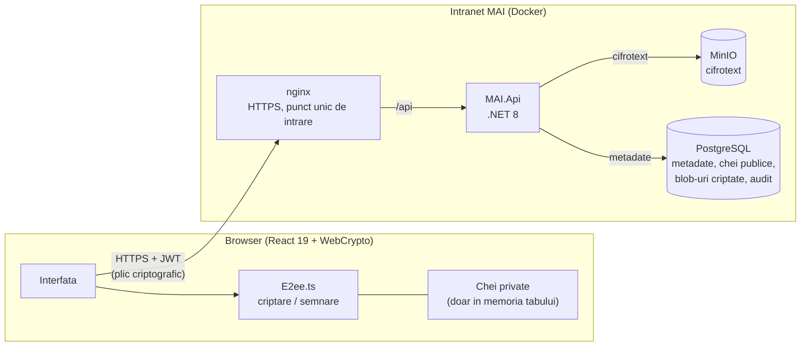
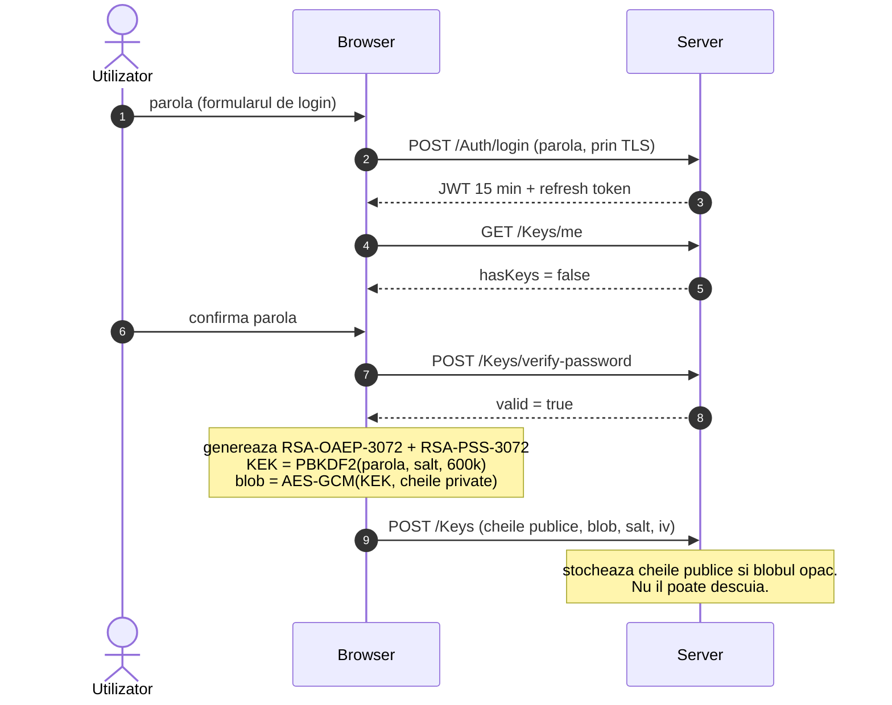
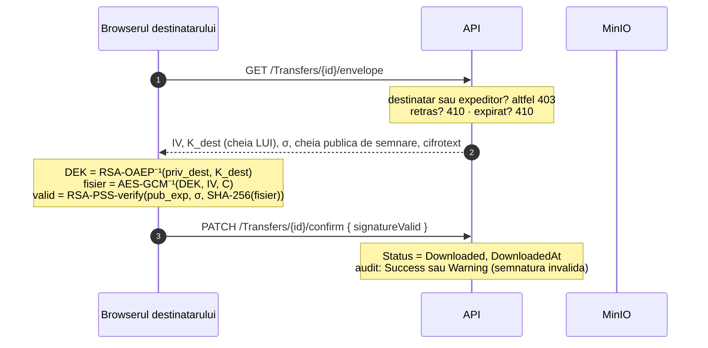

# SGDM: Sistem de Gestiune a Documentelor si Transferurilor Securizate

## Scopul proiectului

SGDM este o platforma de intranet dezvoltata pentru **Ministerul Afacerilor Interne al Republicii Moldova**, in cadrul **practicii de productie** la UTM FCIM, programul Securitate Informationala, anul III, 2026.

**Problema rezolvata:** angajatii MAI transmit documente sensibile intre subdiviziuni (rapoarte, ordine interne, procese-verbale) pe canale care nu garanteaza confidentialitatea fata de administratorii de sistem. Un server compromis sau un backup scurs expune tot continutul. SGDM rezolva asta prin criptare **end-to-end** direct in browser: serverul transporta si stocheaza cifrotext pe care nu il poate citi.

**Stack tehnologic:** .NET 8 (ASP.NET Core, EF Core) · React 19 + TypeScript · PostgreSQL 17 · MinIO (S3 auto-gazduit) · nginx · WebCrypto API in browser. Totul ruleaza in Docker, in intranet; nicio componenta nu depinde de un serviciu extern.

**Proiect de practica**, UTM FCIM, Securitate Informationala, 2026.

> Document pentru **evaluare**: ce face sistemul, cum functioneaza si de ce a fost proiectat astfel. Pentru instalare: [`docs/DEPLOYMENT.md`](docs/DEPLOYMENT.md).

---

## Cuprins

1. [Modelul de amenintare](#1-modelul-de-amenintare)
2. [Ce s-a realizat: lista completa](#2-ce-s-a-realizat-lista-completa)
3. [Arhitectura sistemului](#3-arhitectura-sistemului)
4. [Criptarea end-to-end: cine ce cheie detine si cand](#4-criptarea-end-to-end-cine-ce-cheie-detine-si-cand)
5. [Autentificare, sesiuni, autorizare](#5-autentificare-sesiuni-autorizare)
6. [Deciziile de arhitectura si de ce](#6-deciziile-de-arhitectura-si-de-ce)
7. [Calitate: teste, CI, loguri, audit](#7-calitate-teste-ci-loguri-audit)
8. [Structura repository-ului](#8-structura-repository-ului)
9. [Pornire rapida](#9-pornire-rapida)

---

## 1. Modelul de amenintare

### 1.1 Premisa: serverul onest dar curios

Serverul este tratat ca **onest dar curios** (_honest-but-curious_): executa corect protocolul, dar tot ce stocheaza poate ajunge, la un moment dat, pe mana cuiva care nu ar trebui: un administrator de baza de date, un backup scurs, un atacator care a obtinut acces la MinIO.

Sistemul e construit astfel incat in acest scenariu:
- **continutul fisierelor transferate ramane confidential** (criptare end-to-end in browser, serverul nu are niciodata cheia);
- **orice alterare a unui fisier stocat este detectata** (etichete GCM pe segmente, semnatura RSA-PSS a expeditorului, SHA-256 al cifrotextului);
- **documentele normative si interne, desi nu sunt E2EE, sunt criptate la repaus** cu chei care nu stau in baza de date (AES-256-GCM pe segmente, cheie principala din variabile de mediu).

### 1.2 Ce garanteaza sistemul si prin ce mecanism

| Proprietate | Mecanism | Cine verifica |
|---|---|---|
| Confidentialitate transferuri | AES-256-GCM cu cheie aleatorie per transfer, impachetata RSA-OAEP-3072 | Nimeni in afara capetelor nu are cheia |
| Confidentialitate documente normative/interne | AES-256-GCM pe segmente de 64 KiB, DEK per fisier, cheie principala din `.env` | API-ul la citire; cheia nu sta in baza de date |
| Integritate continut transferuri | Tag-ul de autentificare GCM (128 biti) + semnatura RSA-PSS-3072 | Browserul destinatarului; decriptarea esueaza daca e alterat |
| Integritate documente stocate | Segmente autentificate separat (contor + marcaj „ultimul"); SHA-256 in registru | API-ul refuza livrarea daca orice segment e alterat; browserul reverifica SHA-256 la documentele normative |
| Autenticitatea expeditorului | Semnatura RSA-PSS-3072 peste SHA-256 al continutului in clar | Browserul destinatarului, cu cheia publica de semnare |
| Integritatea incarcarii | SHA-256 al cifrotextului declarat de client, recalculat de server | Serverul, inainte de a scrie in MinIO |
| Non-repudiere | Semnatura RSA-PSS ramane pe transfer; dovada de primire per destinatar | Jurnal de audit |
| Trasabilitate completa | Jurnal de audit cu `Success / Warning / Failure`, exportabil in Excel/CSV | Administrator si Sef de directie |
| Detectarea alterarii stocarii | `StorageIntegrityFailure` in audit; fisierul NU se livreaza | API-ul, automat la fiecare descarcare |

### 1.3 Ce NU garanteaza si limitarile constiente

| Limitare | Explicatie | De ce e acceptabila |
|---|---|---|
| Numele fisierelor transferate nu sunt criptate | Serverul le vede, pentru cautare si listare | Varianta stricta (nume in plic) pierde cautarea server-side |
| `AllowForward` e o regula de canal, nu o garantie criptografica | Un destinatar care a descarcat fisierul il poate trimite pe alt canal | Orice redistribuire prin SGDM lasa urma in jurnal |
| Documentele normative si interne nu sunt E2EE | Serverul decide distributia pe structura organizatorica | E2EE ar impiedica accesul colegilor transferati ulterior |
| Dovada de primire e o afirmatie a clientului | Confirmarea „descarcat" si rezultatul verificarii semnaturii le trimite browserul destinatarului; serverul nu le poate verifica singur fara textul in clar | Prin constructie, serverul nu are textul in clar. Orice confirmare ramane legata de cont, IP si ora in jurnal |
| Un atacator care controleaza procesul API are cheile de stocare in memorie | Criptarea la repaus nu protejeaza impotriva acestui scenariu | Pentru asta exista E2EE (la transferuri) |
| Parola ajunge la server la autentificare | Serverul o verifica (Argon2id local sau bind LDAPS). Un server compromis activ, care ruleaza cod modificat, ar putea-o retine si deriva din ea cheia care descuie cheile private | Modelul este serverul onest dar curios si scurgerea datelor stocate, nu un server care executa cod strain. Remediere planificata: derivari separate in browser, o cheie de autentificare trimisa la server si o cheie de impachetare care nu pleaca din browser. Pentru conturile de domeniu parola trebuie oricum sa ajunga la controlerul de domeniu |
| Blobul cheilor private permite ghicirea offline a parolei | Blobul e criptat cu PBKDF2(parola, 600.000 iteratii), fara niciun secret al serverului. Dintr-o copie a bazei, fiecare parola incercata se verifica prin tag-ul GCM, ocolind pepper-ul care protejeaza hash-ul Argon2id | Costul per incercare e mare, politica cere minim 12 caractere din 4 clase, iar backup-ul bazei e cifrat GPG. Remediere planificata: Argon2id in browser (WASM) sau o componenta a cheii eliberata de server doar dupa autentificare |
| Un administrator poate prelua identitatea criptografica a unui cont | Dupa o resetare cu parola temporara, administratorul cunoaste parola, se poate autentifica, o poate schimba si poate genera chei noi; expeditorii ar cifra apoi pentru cheile lui | Fiecare pas ramane in jurnal (resetare, autentificare, inregistrare chei, cu IP). Amprentele cheilor se compara in afara canalului. Resetarea prin link pe email nu expune parola administratorului si e varianta recomandata |
| Semnatura acopera continutul, nu si metadatele | Numele fisierului, categoria si lista destinatarilor nu intra in semnatura; serverul le-ar putea modifica fara ca verificarea sa esueze | Continutul, singurul care conteaza ca proba, e semnat; orice modificare facuta prin API lasa urma in jurnal |
| Plicul de stocare nu e legat de cheia obiectului | Cine poate scrie in MinIO poate inlocui un document criptat cu alt document criptat valid. API-ul il decripteaza fara eroare; inlocuirea o detecteaza browserul, care compara SHA-256 al fisierului primit cu registrul (la documentele normative si la cele interne) si refuza sa-l salveze | Necesita acces de scriere in MinIO, care asculta doar local. Remediere planificata: cheia obiectului in datele asociate (AAD) ale plicului, ca verificarea sa se faca si pe server |

### 1.4 Unde sa va uitati in cod, in ordinea asta

1. [`frontend/src/crypto/E2ee.ts`](frontend/src/crypto/E2ee.ts): toata criptografia, ~300 de linii efective, comentate complet.
2. [`MAI.BusinessLogic/Storage/Encryption/StorageEnvelope.cs`](MAI.BusinessLogic/Storage/Encryption/StorageEnvelope.cs): criptarea documentelor la repaus (formatul, segmentarea, AAD).
3. [`MAI.Api/Controllers/TransfersController.cs`](MAI.Api/Controllers/TransfersController.cs): ce face serverul cu un transfer (si ce nu face).
4. [`MAI.Api/Program.cs`](MAI.Api/Program.cs): configurarea de securitate si validarile care opresc pornirea cu configuratie nesigura.
5. [`MAI.Tests/`](MAI.Tests/): ce este verificat automat la fiecare push.

---

## 2. Ce s-a realizat: lista completa

### 2.1 Transferuri securizate E2EE

- **Trimitere** cu criptare AES-256-GCM + impachetare RSA-OAEP-3072 si semnatura RSA-PSS-3072, integral in browser.
- **Destinatari multipli**: acelasi fisier se impacheteaza pentru fiecare destinatar ales, stocat in tabelul `TransferRecipients`; fiecare destinatar vede si poate decripta doar propria copie a cheii.
- **Retransmitere (forward)**: expeditorul sau destinatarul (daca `AllowForward`) poate retrimite din propria copie a DEK-ului catre colegi noi; fiecare forward lasa urma in audit (`TransferForwarded`).
- **Dovada de primire per destinatar**: browserul destinatarului raporteaza daca semnatura expeditorului este valida la deschidere; o semnatura invalida apare ca `Warning` in jurnal si in panoul de alerte.
- **Retragere transfer**: expeditorul poate retrage un fisier; cifrotextul se sterge din MinIO, randul ramane marcat `Retras` cu motiv si cu marcaj de timp.
- **Categorii**: Critical, Important, General, Obisnuit, filtrate in interfata cu culori distincte.
- **Expirare configurabila**: termenul de valabilitate e setat per transfer (implicit 7 zile, maxim 30); un job de fundal ruleaza la fiecare 15 minute si curata transferurile expirate.

### 2.2 Registru normativ de documente

- Publicare cu **versionare**: fiecare versiune are SHA-256 calculat si stocat; browserul il reverifica la descarcare.
- Descarcarea oricarei versiuni anterioare cu trasabilitate completa in audit.
- Cautare dupa titlu, numar, categorie si cuvinte-cheie.
- **Criptare la repaus** (AES-256-GCM pe segmente, cheie principala din `.env`): documentele nu ajung niciodata in clar in MinIO.

### 2.3 Documente interne distribuite pe structura organizatorica

- **Publicare** cu distributie flexibila: subdiviziunea mea, subordonatii directi, subdiviziuni alese, sefii de subunitati, persoane nominale, toata institutia.
- **Lista de destinatari fixata la publicare**: cine intra ulterior in subdiviziune nu apare, cine pleaca ramane; lista e cea fata de care se masoara „luat la cunostinta".
- **Confirmare „Luat la cunostinta"** cu trasabilitate: data primei deschideri si data confirmarii, per destinatar.
- **Abrogare** cu motiv, pastrand documentul vizibil ca istoric.
- **Criptare la repaus** identica cu documentele normative.

### 2.4 Structura organizatorica ierarhica

- **Niveluri configurabile**: Directie (100), Sectie (200), Serviciu (300), cu posibilitatea administratorului de a adauga niveluri intermediare (Departament la 150, Birou la 400).
- **Sef de subdiviziune** definit de unitatea condusa (`HeadUserId`), nu de rol: un utilizator obisnuit poate conduce o sectie.
- Validare de structura: un copil are rangul strict mai mare decat parintele.
- Import din **Active Directory** (unitati organizatorice → subdiviziuni, cu mapare pe DN).

### 2.5 Gestionarea conturilor si invitatii

- **Creare cont cu invitatie prin email**: token 256-bit (SHA-256 in DB), email HTML cu link de activare valabil 72 ore, cont blocat pana la confirmare.
- **Retrimitere invitatie** de catre administrator daca linkul a expirat.
- **Schimbare parola fortata** (`MustChangePassword`) la creare fara email sau dupa resetare. Aplicata de server: tokenul emis cu parola temporara poarta claim-ul `pwd_change`, iar `PasswordChangeRequiredFilter` raspunde 403 (`PASSWORD_CHANGE_REQUIRED`) pe orice endpoint in afara schimbarii parolei.
- **Resetare parola prin email**: link separat de invitatie, cu token propriu.
- **Gestionare sesiuni per dispozitiv**: fiecare autentificare deschide o sesiune separata cu IP, user-agent si ultima activitate, vizibila si revocabila din profil.
- **Activare / dezactivare cont** cu revocare imediata a tuturor sesiunilor.
- **Modificare rol** cu validari de garda (ultimul administrator nu poate fi retrogradat).

### 2.6 Autentificarea cu Active Directory (LDAP/LDAPS)

- **Provizionare automata** la prima autentificare cu cont de domeniu.
- **Sincronizare atribute** la fiecare login (nume, email, rol din grupuri, subdiviziune, stare).
- **Import structura** din unitatile organizatorice AD, cu mapare pe subdiviziunile SGDM.
- **Reimpachetare chei** la schimbarea parolei in domeniu (detectata prin `pwdLastSet`).
- Laborator inclus: Samba AD in Docker, cu script de provizionare (`scripts/samba-ad-setup.ps1`).

### 2.7 Securitate multi-strat

| Mecanism | Detalii |
|---|---|
| Hash parole | Argon2id, format PHC, pepper extern, doua profiluri de cost (Interactive / Sensitive) |
| Protectie DoS Argon2 | Semafor cu maxim 4 hash-uri simultane; depasit → 503 + `Retry-After` |
| Politica de parole | Lungime, clase de caractere, interzicere username in parola, lista de parole banale |
| Blocare cont | Progresiva, exponentiala: 5 esecuri → 5 min, dublu pana la 8 h |
| Rate limiting | Per IP, pe categorii: login, refresh, operatii cu parola, upload |
| 2FA TOTP (RFC 6238) | Secret cifrat, fereastra de ±1 interval, reprotectie anti-replay, 10 coduri de recuperare |
| 2FA obligatoriu pe roluri privilegiate | `PrivilegedMfaFilter` verifica `amr = mfa` pe endpointurile de administrator |
| Confirmare email | Token aleatoriu 256-bit, SHA-256 in DB, expiry 72 h, blocare login pana la activare |
| Criptare documente la repaus | AES-256-GCM pe segmente, DEK per fisier, cheie principala din `.env`, rotire fara re-criptare continut |
| Unicitate conturi | Username si email unice fara diferenta de majuscule (indexuri pe `lower(...)`) |
| Antet criptografic | CSP, `nosniff`, `X-Frame-Options: DENY`, `Referrer-Policy`, HSTS pe HTTPS |
| Perimetru intranet | Middleware care respinge IP-urile din afara plajelor configurate (dezactivat implicit, cu mod audit) |
| Revocare imediata a sesiunii | Claim `sid` in JWT, verificat la fiecare cerere; delogarea, dezactivarea sau schimbarea rolului au efect imediat |
| Refuz configuratie nesigura | Pornirea esueaza explicit daca lipsesc secretele sau exista valori-sablon (`YOUR_…`) |

### 2.8 Notificari email (SMTP / MailKit)

- Email de **invitatie** la crearea contului: template HTML cu antet MAI.
- Email de **notificare transfer primit**: expeditor, nume fisier, data expirare.
- Email de **resetare parola** cu link securizat.

### 2.9 Jurnal de audit si rapoarte

- 25 tipuri de actiuni consemnate (de la login pana la `StorageIntegrityFailure` si `DirectoryStructureImported`).
- Filtru pe actiune, rezultat (`Success / Warning / Failure`), utilizator, interval de timp.
- Export in **XLSX** si **CSV** direct din interfata.
- **Alerte de securitate** pe `/admin`: autentificari esuate repetate, coduri de recuperare 2FA folosite, semnaturi invalide la descarcare, conturi privilegiate fara 2FA activat, incercari de acces cu certificat nevalid.
- **Rapoarte grafice**: transferuri pe zi, distributie pe categorii, utilizatori activi (alimentate de `StatsController`).

### 2.10 Infrastructura si operare

- **Docker Compose** complet: PostgreSQL 17, MinIO (S3), API .NET, nginx cu HTTPS, frontend React, totul cu o singura comanda.
- **Backup si restaurare** automatizate: `pg_dump` + `mc mirror` + cifrare GPG, cu verificare SHA-256 si comparare rand cu rand.
- **Recriptare depozit** (`storage:recrypt`): migrarea fisierelor vechi la criptare la repaus, cu verificare de integritate inainte si dupa.
- **Rotirea cheii principale** fara re-criptare continut (doar re-impachetare DEK).
- **Health check-uri**: `/api/health` (PostgreSQL + MinIO, timeout 3 s), `/api/health/live` (pentru Docker).
- **CI complet** (GitHub Actions): build, teste, lint, imagini Docker, backup/restaurare, verificari nginx (CSP, TLS, redirect).

---

## 3. Arhitectura sistemului



Backend-ul e organizat pe straturi cu o singura directie de dependenta:

| Proiect | Rol | Depinde de |
|---|---|---|
| `MAI.Domain` | Entitati si enumerari. Zero logica, zero dependente. | - |
| `MAI.DataAccessLayer` | `AppDbContext`, configurari EF, migrari versionate | Domain |
| `MAI.BusinessLogic` | Argon2id, TOTP, politica de parole, stocare fisiere, criptare depozit, E-mail | Domain |
| `MAI.Api` | Controllere, middleware, servicii de sesiune si token, job-uri | toate |
| `MAI.Tests` | Teste unitare si de arhitectura (xUnit, fara baza de date) | Api, BusinessLogic, Domain |
| `MAI.IntegrationTests` | Teste de integrare pe PostgreSQL real (Testcontainers, necesita Docker) | Api, BusinessLogic, DataAccessLayer |

Toate componentele stau in intranet. Baza de date a fost mutata din Supabase (cloud) in Docker tocmai pentru ca modelul de amenintare presupune ca nimic nu iese din institutie: conturile, jurnalul de audit si metadatele transferurilor nu au ce cauta pe un server extern.

In modul publicat, browserul vorbeste doar cu nginx, iar cifrotextul trece prin API. In modul de dezvoltare, API-ul emite un URL temporar semnat (5 minute) spre MinIO, iar browserul descarca direct.

---

## 4. Criptarea end-to-end: cine ce cheie detine si cand

### 4.1 Inventarul cheilor

| Cheie | Unde se naste | Unde sta | Cine o are in clar | Cat traieste |
|---|---|---|---|---|
| **Parola** utilizatorului | Tastatura | Pe server doar hash Argon2id + pepper | Utilizatorul; serverul, pe durata cererii de login | Pana la schimbare |
| **KEK**: cheia de impachetare (AES-256, PBKDF2-SHA256, 600.000 iteratii) | Browser, derivata din parola + salt | Nicaieri | Browserul, doar pe durata descuierii | Secunde |
| **Pereche RSA-OAEP-3072** (criptare) | Browser, la prima autentificare | Publica: `Users.PublicKeyEncryption`. Privata: in blobul criptat cu KEK | Privata: doar tabul titularului, **non-extractable** | Pana la resetarea contului |
| **Pereche RSA-PSS-3072** (semnare) | La fel | La fel | La fel | La fel |
| **DEK**: cheia de fisier transfer (AES-256-GCM) | Browserul expeditorului, per transfer | Doar impachetata, pentru fiecare destinatar si pentru expeditor | Expeditorul la trimitere, destinatarul la deschidere | Cat transferul |
| **DEK**: cheia de fisier stocare (AES-256-GCM) | API-ul, per document | Impachetata cu cheia principala, in antetul fisierului | API-ul la citire/scriere | Cat documentul |
| **Cheia principala** stocare | Operatorul (`openssl rand`) | `.env` (`MAI_STORAGE_MASTER_KEYS`) | Procesul API | Pana la rotire |
| Secret **TOTP** | Server | `Users.TwoFactorSecret`, cifrat AES-GCM cu `MAI_TWOFACTOR_KEY` | Serverul (necesar pentru verificarea codului) | Pana la dezactivare |
| **Refresh token** (512 biti aleatori) | Server | In `UserSessions` doar SHA-256; in clar in browser | Browserul | 7 zile, rotit la fiecare folosire |
| **Token invitatie** (256 biti aleatori) | Server, la creare cont | SHA-256 in `Users.InvitationToken`; tokenul brut doar in email | Nimeni dupa trimitere | 72 ore |
| **Cheia JWT**, **pepper-ul Argon2**, **cheia 2FA** | Operatorul (`openssl rand`) | Variabile de mediu, niciodata in Git | Procesul API | Pana la rotire |

Serverul nu stocheaza nimic care sa ii permita sa deschida un fisier transferat: are cheile publice (care cripteaza), blob-uri incuiate cu parole pe care nu le stocheaza si DEK-uri impachetate cu chei private pe care nu le are. Singurul moment in care ar putea obtine mai mult este autentificarea, cand primeste parola; limitarea e descrisa in sectiunea 1.3.

### 4.2 Prima autentificare: generarea cheilor



### 4.3 Trimiterea unui fisier

```mermaid
sequenceDiagram
    autonumber
    participant BA as Browserul expeditorului
    participant S as API
    participant M as MinIO
    participant DB as PostgreSQL

    BA->>S: GET /Keys/recipients
    S-->>BA: cheile publice ale destinatarilor + amprente
    Note over BA: DEK = AES-256 aleator, IV = 96 biti aleatori<br/>C = AES-GCM(DEK, IV, fisier)<br/>K_dest = RSA-OAEP(pub_destinatar, DEK), pentru fiecare<br/>K_exp  = RSA-OAEP(pub_expeditor, DEK)<br/>σ = RSA-PSS(priv_expeditor, SHA-256(fisier))
    BA->>S: POST /Transfers (C, IV, K_dest[], K_exp, σ, SHA-256(C))
    Note over S: recalculeaza SHA-256(C); nepotrivire → 400, nu scrie nimic
    S->>M: PUT transfers/{an}/{luna}/{guid}.enc
    S->>DB: FileTransfers + TransferRecipients + AuditLogs
```

### 4.4 Primirea si dovada de primire



### 4.5 Schimbarea parolei

Cheile private sunt incuiate cu parola. Schimbarea parolei fara reimpachetarea blobului ar face toate fisierele primite inaccesibile:

1. Browserul descuie blobul cu parola **veche** si il reincuie cu cea **noua**. O parola veche gresita se afla aici, local, inainte ca serverul sa schimbe ceva.
2. `PATCH /Auth/change-password` primeste parola curenta, parola noua **si** blobul reimpachetat. Serverul salveaza hash-ul nou si blobul in aceeasi tranzactie, apoi inchide toate sesiunile, inclusiv pe cea curenta. Pentru un cont cu chei, cererea fara blob e refuzata (`KEYS_REWRAP_REQUIRED`): parola si cheile nu pot ajunge nesincronizate.
3. Utilizatorul se autentifica din nou cu parola noua, care ii descuie si cheile.

`PATCH /Keys/rewrap` ramane doar pentru conturile de domeniu, a caror parola se schimba in Active Directory, in afara aplicatiei.

---

## 5. Autentificare, sesiuni, autorizare

| Mecanism | Implementare | Parametri |
|---|---|---|
| Hash parole | Argon2id + pepper, format PHC, doua profiluri de cost | Interactive: 19 MiB, t=2. Sensitive (admin): 64 MiB, t=3 |
| Confirmare email la creare cont | Token 256-bit (SHA-256 in DB), link valabil 72 h, login blocat pana la activare | Retrimitere disponibila din panoul de administrare |
| Schimbare parola fortata | `MustChangePassword = true` la creare fara email sau dupa resetare | Claim `pwd_change` in JWT; `PasswordChangeRequiredFilter` blocheaza tot API-ul in afara `change-password` si `Keys/me` |
| Politica de parole | Lungime, clase, interzicere username, lista parole banale | Minim 12 caractere |
| Blocare cont | Progresiva, exponentiala | 5 esecuri → 5 min, dublu pana la 8 h |
| Rate limiting | Ferestre fixe per IP, per categorie | Login 10/5 min · Refresh 30/min · Parole 5/15 min |
| 2FA TOTP (RFC 6238) | Secret cifrat AES-GCM; token de provocare opac (nu JWT); anti-replay | 30 s, ±1 fereastra; 10 coduri de recuperare |
| 2FA pe roluri privilegiate | `PrivilegedMfaFilter` pe endpointurile cu rol ≥ Sef directie | Activabil din `TwoFactor:RequiredForPrivilegedRoles` |
| Token de acces | JWT HS256, issuer si audience validate, `ClockSkew = 0`; claim `sid` verificat la fiecare cerere (`SessionTokenValidator`): sesiunea deschisa, contul activ, rolul neschimbat | 15 minute, dar invalid imediat ce sesiunea se inchide |
| Sesiuni | Per dispozitiv (`UserSessions`), refresh token opac rotit, stocat SHA-256 | 7 zile, vizibil si revocabil din profil |
| Autorizare | Roluri declarate explicit pe fiecare endpoint, verificate automat in CI | Utilizator (1) · Sef directie (2) · Administrator (3) |
| Unicitate conturi | Username si email unice, fara diferenta de majuscule | Indexuri pe `lower(...)`, email optional |
| Perimetru | Middleware intranet-only pe plaje IP configurate | Dezactivat implicit; mod `AuditOnly` pentru rodaj |
| Antete de securitate | CSP, `nosniff`, `X-Frame-Options`, `Referrer-Policy`, HSTS | Pe toate raspunsurile API inclusiv 403 si 429 |

### Fluxul de invitatie in detaliu


Operatiile care inchid **toate** sesiunile: schimbarea sau resetarea parolei, rotatia 2FA, schimbarea rolului, dezactivarea contului. Inchiderea are efect la cererea urmatoare si asupra tokenului de acces deja emis, nu doar asupra refresh token-ului. Blocarea contului dupa esecuri **nu** le inchide: altfel oricine ar putea deconecta pe oricine cu 5 cereri gresite.

---

## 6. Deciziile de arhitectura si de ce

### D1. Criptarea se face in browser, nu pe server

**Alternativa:** criptare la repaus pe server (TDE, SSE-S3). **De ce nu:** cheia ar sta langa date. Oricine compromite serverul le are pe amandoua.

### D2. Criptare cu plic: o cheie aleatorie per transfer

**Alternativa:** criptarea directa cu RSA. **De ce nu:** RSA-OAEP-3072 cripteaza cel mult ~318 octeti si este de ordine de marime mai lent. Cu plic, fisierul se cripteaza simetric (rapid, orice dimensiune), iar RSA acopera doar cei 32 de octeti ai DEK-ului. Destinatarii multipli devin o extensie naturala.

### D3. Perechi RSA separate pentru criptare si semnare

Refolosirea aceleiasi chei RSA pentru ambele operatii este o slabiciune documentata. WebCrypto nu o permite oricum.

### D4. Cheile private, incuiate cu parola, stocate pe server

**De ce nu pe dispozitiv:** un calculator reinstalat inseamna fisiere pierdute definitiv. **De ce nu fisier exportat:** un fisier de chei uitat pe desktop este mai rau decat un blob criptat in baza de date.

### D5. Token de acces in `Authorization`, nu in cookie

Fara cookie nu exista CSRF clasic.

### D6. Sesiuni per dispozitiv, cu refresh token opac

O singura coloana de refresh token per user ar deconecta toate dispozitivele la fiecare reinnoire.

### D7. MinIO auto-gazduit, cu URL-uri presemnate (dezvoltare) / proxy prin API (productie)

In productie, cifrotextul trece prin API. Costul (o copie in plus) e neglijabil in intranet.

### D8. Retragerea nu este o stergere

Un transfer retras ramane in lista, marcat cu motivul. Daca ar disparea, destinatarul nu ar putea verifica ce s-a intamplat.

### D9. Aplicatia refuza sa porneasca cu configuratie nesigura

Pornirea esueaza explicit daca: cheia JWT e prea scurta, pepper-ul lipseste, orice secret are valoarea-sablon, parolele in clar sunt activate.

### D10. Jurnalul de audit, separat de loguri

**Auditul** sta in baza de date, vizibil in aplicatie. **Logurile** (Serilog, JSON) raspund la „ce s-a intamplat cu procesul". Niciun secret nu ajunge in loguri.

### D11. Un singur punct de intrare: nginx cu HTTPS

Un singur serviciu expus, cu TLS 1.2/1.3, CSP stricta ca antet HTTP, IP-ul real al clientului extras din `X-Forwarded-For` doar de la IP-ul fix al containerului web.

### D12. Criptarea documentelor la repaus cu cheie principala externa

Documentele normative si interne nu pot fi E2EE (serverul decide distributia), dar nu trebuie sa stea in clar in MinIO. Criptarea pe segmente de 64 KiB cu cheie principala din `.env` protejeaza impotriva dump-urilor de volum si backup-urilor pierdute, fara a incetini livrarea.

---

## 7. Calitate: teste, CI, loguri, audit

**Integrare continua** (`.github/workflows/ci.yml`), la fiecare push si pull request:

- verifica ca fiecare migrare EF are fisierul `.Designer.cs`;
- `dotnet build` si `dotnet test`;
- `npm run build` (`tsc -b` strict + `vite build`) si `oxlint`;
- construieste cele trei imagini Docker (API, web, backup);
- porneste imaginea web si verifica HTTPS-ul: CSP stricta, redirect HTTP → HTTPS, refuz TLS 1.1, refuz cerere > 52 MB;
- **backup si restaurare completa** pe serviciile din compose, cu comparare rand cu rand.

**Teste** (xUnit, fara baza de date):

| Suita | Ce verifica |
|---|---|
| `StorageEncryptionTests` | Criptare/decriptare pe segmente, rotire cheie, detectare alterare, fisiere in clar |
| `Argon2PasswordHasherTests` | Hash, verificare, pepper, profiluri de cost, migrare de pe parole in clar |
| `TotpServiceTests` | RFC 6238, fereastra de toleranta, coduri de recuperare |
| `TotpReplayTests` | Un cod acceptat nu mai trece a doua oara |
| `SecurityTests` | Validare CSP, antete, configuratie JWT |
| `AuthorizationPolicyTests` | Fiecare endpoint are o decizie de autorizare explicita |
| `HardeningTests` | Refuzul configuratiei nesigure, placeholder-uri detectate |
| `LdapDirectoryTests` | Provizionare, sincronizare, mapare roluri din grupuri |
| `MigrationsTests` | Fiecare migrare are Designer.cs; migrari ordonate |
| `DistributionResolverTests` | Distributia documentelor interne pe structura organizatorica |
| `TransferRulesTests` | Politica de expirare, forward, retragere, stari |
| `OrgTreeTests` / `OrgLevelRulesTests` | Validarea ierarhiei si a nivelurilor |
| `PasswordChangeRequiredFilterTests` | Parola temporara blocheaza API-ul; lista endpointurilor exceptate e exact cea cunoscuta |
| `AuditLogLimitsTests` | Un rand de audit prea lung se trunchiaza, nu anuleaza operatia consemnata |

**Teste de integrare** (`MAI.IntegrationTests`): API-ul real pe PostgreSQL real, pornit de Testcontainers (necesita Docker), cu migrarile aplicate exact ca in productie. Acopera ciclul complet al transferurilor (inclusiv anti-IDOR), resetarea parolei prin link, blocarea API-ului cu parola temporara, invalidarea imediata a tokenului de acces la delogare si la dezactivarea contului, schimbarea atomica parola + chei si un transfer catre 20 de destinatari cu nume lungi. Provider-ul EF in memorie a fost evitat intentionat: nu cunoaste ILIKE, tranzactiile si indexurile case-insensitive.

**Loguri:** Serilog, o linie JSON per eveniment. Refuzurile 401, 403 si 429 la nivel `Warning`, erorile 5xx la nivel `Error`.

**Health check:** `GET /api/health` (PostgreSQL + MinIO), `GET /api/health/live` (Docker).

---

## 8. Structura repository-ului

```
MAI.Domain/              entitati si enumerari (User, FileTransfer, TransferRecipient,
                         OrgUnit, InternalDocument, etc.)
MAI.DataAccessLayer/     AppDbContext, configurari EF, Migrations/ (versionate, cu Designer.cs)
MAI.BusinessLogic/       Argon2id, TOTP, politica de parole, stocare (Local / S3),
                         criptare depozit (Storage/Encryption/), e-mail, LDAP
MAI.Api/                 controllere (14), middleware, servicii, job-uri, Program.cs
MAI.Tests/               teste xUnit (fara baza de date), ~20 suite
MAI.IntegrationTests/    teste de integrare pe PostgreSQL real (Testcontainers): transferuri,
                         resetare parola, parola temporara, limitele jurnalului
frontend/                React 19 + TypeScript + Vite; src/crypto/ contine E2EE
frontend/Dockerfile      imaginea web: build Vite + nginx (HTTPS, reverse proxy spre API)
frontend/nginx/          configuratia nginx (TLS, antete, CSP) si certificatul autosemnat
deploy/backup/           imaginea de backup: pg_dump + mc + gpg, cu verificare SHA-256
docker-compose.yml       PostgreSQL + MinIO + API + web (+ backup si Samba AD pe profiluri)
Dockerfile               imaginea API-ului (build in doua etape, utilizator neprivilegiat)
scripts/                 Samba AD de test, recriptare depozit, certificat de demonstratie
docs/DEPLOYMENT.md       instalare, HTTPS, backup si restaurare, probleme frecvente
docs/LDAP-AD.md          autentificare cu contul de domeniu, roluri din grupuri AD
docs/STORAGE-ENCRYPTION.md  criptarea documentelor normative si interne in MinIO
.github/workflows/       CI (build + test + lint + imagini Docker + backup/restaurare)
```

---

## 9. Pornire rapida

**Detalii complete in `docs/DEPLOYMENT.md`.**

```bash
cp .env.example .env              # completati secretele: openssl rand -base64 48
docker compose up -d postgres
dotnet ef database update --project MAI.DataAccessLayer --startup-project MAI.Api
```

Dezvoltare (API si frontend pe masina locala):

```bash
docker compose up -d postgres minio minio-init
dotnet run --project MAI.Api
cd frontend && npm ci && npm run dev          # http://localhost:5173
```

Totul in Docker, cu HTTPS (nginx + API + MinIO):

```bash
docker compose up -d --build                  # https://sgdm.local
docker compose --profile backup run --rm backup
```

**Seed demonstrativ** (date realiste pentru prezentare):

```bash
# 1. Datele in PostgreSQL (utilizatori, transferuri, documente, audit)
psql -h localhost -U sgdm -d sgdm -f MAI.DataAccessLayer/Migrations/900_seed_demo.sql

# 2. Fisierele documentelor demonstrative, scrise prin depozitul criptat
dotnet run --project MAI.Api -- demo:seed-files        # sau: docker compose run --rm api demo:seed-files
```

Seed-ul **nu creeaza** administratorul: copiaza hash-ul parolei unui cont existent (variabila `v_sursa_parola` din `900_seed_demo.sql`, implicit `admin`) pe toate conturile demonstrative, care se autentifica apoi cu aceeasi parola. Pe o baza goala, primul administrator se creeaza din linia de comanda:

```bash
dotnet run --project MAI.Api -- admin:create admin --email admin@mai.gov.md --name "Administrator SGDM"
# in Docker: docker compose run --rm -it api admin:create admin
```

Parola se cere de la tastatura, de doua ori, fara ecou (sau din variabila `SGDM_ADMIN_PASSWORD`, pentru automatizare), niciodata ca argument. Contul porneste cu `MustChangePassword = true`, iar crearea ramane in jurnal ca `Warning`.

`demo:seed-files` scrie fisierele prin acelasi depozit ca un upload real, deci ajung in MinIO deja criptate, iar amprentele SHA-256 din baza se recalculeaza din continutul efectiv (cele din SQL sunt provizorii). Atinge doar documentele create de conturile `*.demo` si poate fi rulata de oricate ori. Nu e nevoie de citire in clar sau de `storage:recrypt`.

**Continut demonstrativ:** 20 utilizatori (1 admin, 3 sefi, 16 utilizatori), 5 directii + 5 sectii + 4 servicii, ~50 transferuri in toate starile, 12 documente normative cu versiuni, 8 documente interne cu distributie si confirmari, ~520 randuri de audit, 12 sesiuni active.
