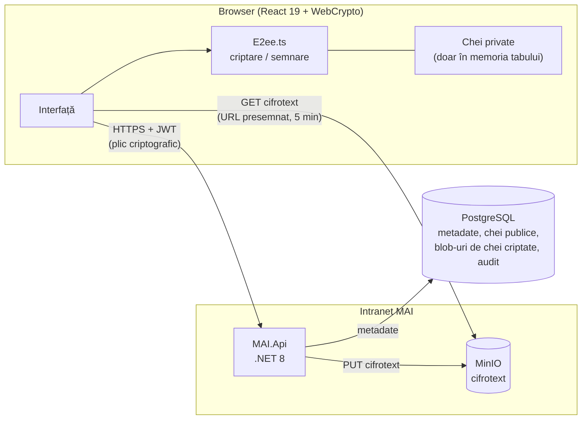
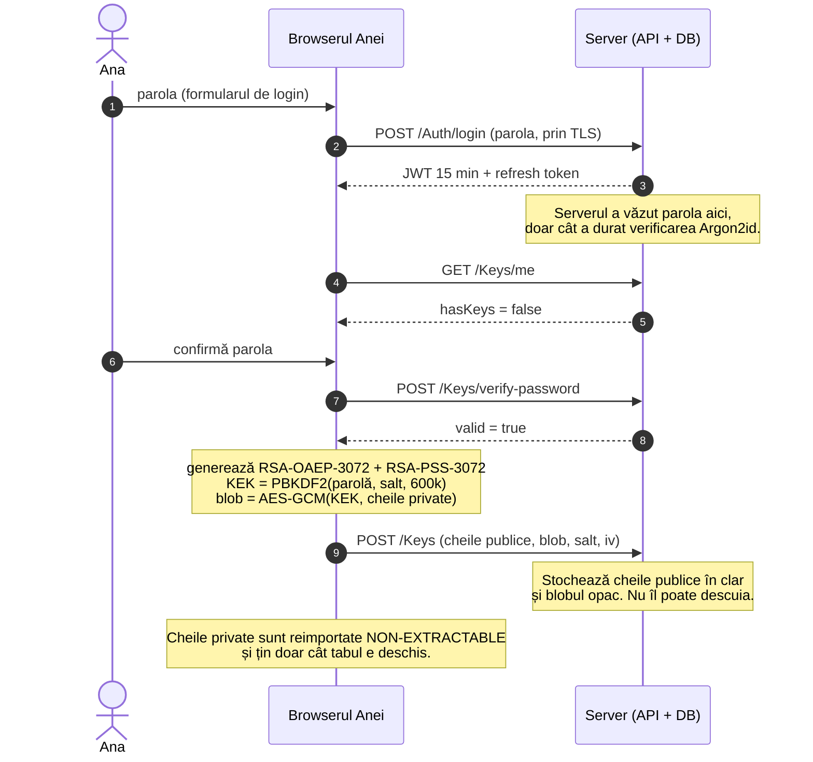
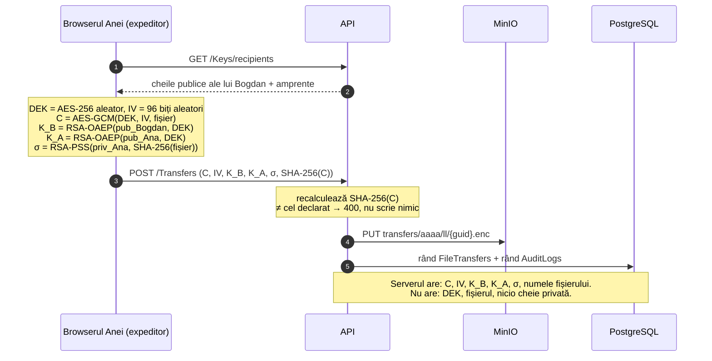
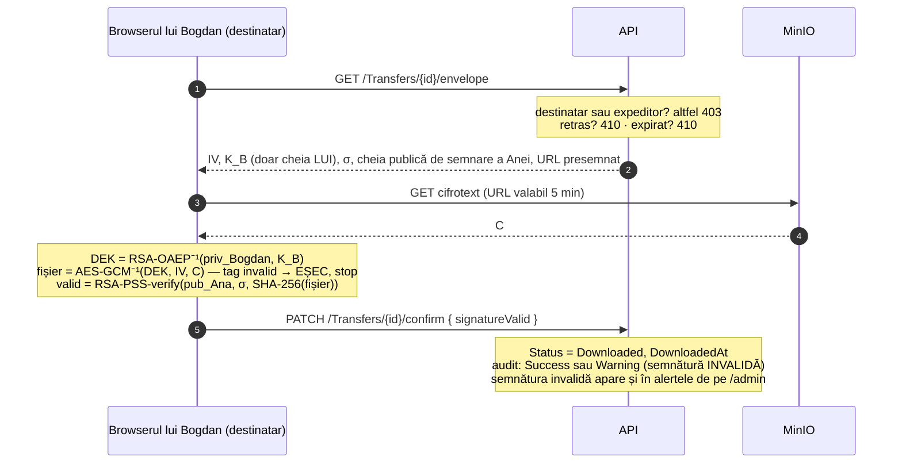

# SGDM — Sistem de Gestiune a Documentelor și Transferurilor Securizate

Platformă de intranet pentru Ministerul Afacerilor Interne: angajații își trimit
documente criptate **end-to-end**, iar serverul care le transportă și le stochează
**nu le poate citi**. Proiect de practică, UTM FCIM, Securitate Informațională.

**Stack:** .NET 8 (ASP.NET Core, EF Core) · React 19 + TypeScript · PostgreSQL
(Supabase sau local) · MinIO (S3 auto-găzduit) · WebCrypto în browser.

> Acest document este pentru **evaluare**: ce face sistemul, cum, de ce așa și
> unde se oprește. Pentru instalare, vezi [`docs/DEPLOYMENT.md`](docs/DEPLOYMENT.md).

---

## Cuprins

1. [Pe scurt, pentru comisie](#1-pe-scurt-pentru-comisie)
2. [Arhitectura](#2-arhitectura)
3. [Criptarea end-to-end: cine ce cheie deține și când](#3-criptarea-end-to-end-cine-ce-cheie-deține-și-când)
4. [Autentificare, sesiuni, autorizare](#4-autentificare-sesiuni-autorizare)
5. [Deciziile de arhitectură și de ce](#5-deciziile-de-arhitectură-și-de-ce)
6. [Ce NU protejează sistemul](#6-ce-nu-protejează-sistemul)
7. [Calitate: teste, CI, loguri, audit](#7-calitate-teste-ci-loguri-audit)
8. [Evoluții posibile](#8-evoluții-posibile)
9. [Structura repository-ului](#9-structura-repository-ului)

---

## 1. Pe scurt, pentru comisie

**Modelul de amenințare.** Serverul este tratat ca **onest dar curios**: execută
corect protocolul, dar tot ce stochează poate ajunge, la un moment dat, pe mâna
cuiva care nu ar trebui — un administrator de bază de date, un backup scurs, un
atacator care a obținut acces la MinIO. Sistemul e construit astfel încât în
acest scenariu conținutul fișierelor să rămână confidențial, iar orice alterare
să fie detectată. Un server **activ malițios** e o problemă mai grea, discutată
deschis în [secțiunea 6](#6-ce-nu-protejează-sistemul).

**Ce garantează, și prin ce mecanism:**

| Proprietate | Mecanism | Cine verifică |
|---|---|---|
| Confidențialitate | AES-256-GCM cu cheie aleatorie per transfer, împachetată RSA-OAEP-3072 | Nimeni în afara celor două capete nu are cheia |
| Integritate | Tag-ul de autentificare GCM (128 biți) | Browserul destinatarului; decriptarea eșuează, nu produce gunoi |
| Autenticitatea expeditorului | Semnătură RSA-PSS-3072 peste SHA-256 al conținutului în clar | Browserul destinatarului, cu cheia publică de semnare a expeditorului |
| Integritatea încărcării | SHA-256 al cifrotextului, declarat de client și recalculat pe server | Serverul, înainte de a scrie în MinIO |
| Trasabilitate | Jurnal de audit în baza de date, cu rezultat Success / Warning / Failure | Administratorul și șeful de direcție |

**Unde să vă uitați în cod, în ordinea asta:**

1. [`frontend/src/crypto/E2ee.ts`](frontend/src/crypto/E2ee.ts) — toată
   criptografia, aproximativ 300 de linii efective, comentate.
2. [`MAI.Api/Controllers/TransfersController.cs`](MAI.Api/Controllers/TransfersController.cs)
   — ce face serverul cu un transfer. Mai important: ce **nu** face.
3. [`MAI.Api/Program.cs`](MAI.Api/Program.cs) — configurarea de securitate și
   validările care opresc pornirea.
4. [`MAI.Tests/`](MAI.Tests/) — ce este verificat automat.

---

## 2. Arhitectura



Backend-ul e împărțit pe straturi, fiecare cu o singură direcție de dependență:

| Proiect | Rol | Depinde de |
|---|---|---|
| `MAI.Domain` | Entități și enumerări. Fără logică, fără dependențe. | — |
| `MAI.DataAccessLayer` | `AppDbContext`, configurări EF, migrări | Domain |
| `MAI.BusinessLogic` | Argon2id, TOTP, politica de parole, stocare fișiere | Domain |
| `MAI.Api` | Controllere, middleware, servicii de sesiune și token, job-uri | toate |
| `MAI.Tests` | Teste unitare și de arhitectură (xUnit) | Api, BusinessLogic, Domain |

Fișierele nu trec prin API la descărcare. API-ul autorizează cererea, semnează un
URL temporar către MinIO, iar browserul descarcă direct cifrotextul. Cine nu are
dreptul nu primește niciodată un URL.

---

## 3. Criptarea end-to-end: cine ce cheie deține și când

### 3.1 Inventarul cheilor

| Cheie | Unde se naște | Unde stă | Cine o are în clar | Cât trăiește |
|---|---|---|---|---|
| **Parola** utilizatorului | Tastatura | Pe server doar hash Argon2id + pepper | Utilizatorul; serverul, pe durata cererii de login | Până la schimbare |
| **KEK** — cheia de împachetare (AES-256, PBKDF2-SHA256, 600.000 iterații) | Browser, derivată din parolă + salt | Nicăieri | Browserul, doar pe durata descuierii | Secunde |
| **Pereche RSA-OAEP-3072** (criptare) | Browser, la prima autentificare | Publica: `Users.PublicKeyEncryption`. Privata: în blobul criptat cu KEK | Privata: doar tabul deschis al titularului, **non-extractable** | Până la resetarea contului |
| **Pereche RSA-PSS-3072** (semnare) | La fel | La fel | La fel | La fel |
| **DEK** — cheia de fișier (AES-256-GCM) | Browserul expeditorului, per transfer | Doar împachetată, de două ori: pentru destinatar și pentru expeditor | Expeditorul la trimitere, destinatarul la deschidere | Cât transferul |
| Secret **TOTP** | Server | `Users.TwoFactorSecret`, cifrat AES-GCM cu `MAI_TWOFACTOR_KEY` | Serverul (trebuie, ca să verifice codul) | Până la dezactivare |
| **Refresh token** (512 biți aleatori) | Server | În `UserSessions` doar SHA-256 al lui; în clar în browser | Browserul | 7 zile, rotit la fiecare folosire |
| **Cheia JWT**, **pepper-ul Argon2**, **cheia 2FA** | Operatorul (`openssl rand`) | Variabile de mediu, niciodată în Git | Procesul API | Până la rotire |

Serverul nu deține, în niciun moment, nimic care să îi permită să deschidă un
fișier: are cheile publice (care doar criptează), blob-uri încuiate cu parole pe
care nu le stochează și DEK-uri împachetate cu chei private pe care nu le are.

### 3.2 Prima autentificare: generarea cheilor



Verificarea parolei de la pasul 5 nu e redundantă. Dacă utilizatorul greșește
parola la confirmare, cheile s-ar încuia cu o parolă care nu există, iar la
următoarea autentificare ar fi pierdute definitiv.

### 3.3 Trimiterea unui fișier



DEK-ul se împachetează și pentru expeditor. Fără asta, Ana nu și-ar mai putea
deschide propriile fișiere trimise. Tot asta permite **retransmiterea** după o
resetare de cont (vezi 6.5).

### 3.4 Primirea și dovada de primire



Serverul nu poate verifica singur semnătura: nu are textul în clar. „Dovada de
primire” este, prin urmare, **ce raportează browserul destinatarului**, nu o
dovadă criptografică. Limita e discutată în 6.3.

### 3.5 Schimbarea parolei

Cheile private sunt încuiate cu parola. Dacă parola se schimbă fără ca blobul să
fie reîmpachetat, toate fișierele primite devin imposibil de deschis. Ordinea
operațiilor e aleasă ca niciun pas eșuat să nu producă pierdere de date:

1. Browserul descuie blobul cu parola **veche** și îl reîncuie cu cea **nouă**,
   local. Dacă parola veche e greșită, se oprește aici și nimic nu s-a modificat.
2. `PATCH /Auth/change-password` schimbă hash-ul și închide toate sesiunile.
3. `PATCH /Keys/rewrap` trimite blobul nou, **împreună cu parola nouă**, pe care
   serverul o verifică. Dacă pasul eșuează (rețea), pagina păstrează blobul și
   oferă reîncercarea.

De ce cere pasul 3 parola: fără ea, un token de acces furat ar putea suprascrie
blobul cu gunoi, iar serverul nu poate deosebi un blob valid de unul corupt. Fără
key escrow, rezultatul ar fi pierderea definitivă a tuturor fișierelor primite.

---

## 4. Autentificare, sesiuni, autorizare

| Mecanism | Implementare | Parametri |
|---|---|---|
| Hash parole | Argon2id + pepper (în afara bazei), două profiluri de cost | Interactive: 19 MiB, t=2. Sensitive (roluri privilegiate): 64 MiB, t=3 |
| Protecție DoS pe Argon2 | Semafor de concurență; peste prag → 503 + `Retry-After` | Maxim 4 hash-uri simultane |
| Politica de parole | Lungime, clase de caractere, fără username în parolă | Minim 12 caractere |
| Blocare cont | Progresivă, exponențială | 5 eșecuri → 5 min, dublat până la 8 h |
| Rate limiting per IP | Ferestre fixe, per categorie de endpoint | Login 10 / 5 min · Refresh 30 / min · Operații cu parola 5 / 15 min |
| 2FA | TOTP (RFC 6238), opțional per utilizator, 10 coduri de recuperare de unică folosință | Secret cifrat AES-GCM cu cheie separată |
| Token de acces | JWT HS256, issuer și audience validate, `ClockSkew = 0` | 15 minute |
| Sesiuni | Per dispozitiv (`UserSessions`), refresh token opac rotit, stocat ca SHA-256 | 7 zile |
| Autorizare | Roluri (Utilizator, Șef direcție, Administrator), declarate pe fiecare endpoint și **verificate automat în CI** | vezi `AuthorizationPolicyTests` |
| Perimetru | Middleware care respinge IP-urile din afara plajelor configurate | Dezactivat implicit, cu mod „doar audit” pentru rodaj |
| Antete | CSP, `nosniff`, `X-Frame-Options: DENY`, `Referrer-Policy`, HSTS pe HTTPS | Pe toate răspunsurile API, inclusiv 403 și 429 |

Operațiile care închid **toate** sesiunile unui cont: schimbarea parolei,
resetarea parolei sau a 2FA de către administrator, activarea 2FA, schimbarea
rolului, dezactivarea contului. Utilizatorul poate închide oricând o sesiune
anume sau pe toate celelalte, din profil.

---

## 5. Deciziile de arhitectură și de ce

Fiecare decizie: ce s-a ales, ce alternativă s-a respins și ce costă alegerea.

### D1. Criptarea se face în browser, nu pe server

**Alternativa:** criptare la repaus pe server (TDE, SSE-S3), cu cheia pe server.

**De ce nu:** cheia ar sta lângă date. Oricine compromite serverul le are pe
amândouă. Criptarea la repaus protejează împotriva furtului discului, nu
împotriva celui care administrează sistemul — iar pentru documentele unui
minister, al doilea scenariu e cel relevant.

**Costul:** serverul nu poate căuta în conținut, nu poate genera previzualizări
și nu poate scana fișierele de viruși. Căutarea funcționează doar pe metadate.

### D2. Criptare cu plic: o cheie aleatorie per transfer

**Alternativa:** criptarea directă a fișierului cu RSA.

**De ce nu:** RSA-OAEP-3072 criptează cel mult ~318 octeți și e de ordine de
mărime mai lent. Cu plic, fișierul se criptează simetric (rapid, orice
dimensiune), iar RSA acoperă doar cei 32 de octeți ai DEK-ului. Compromiterea
unui DEK afectează un singur transfer.

**Bonus:** destinatarii multipli devin o extensie naturală — același DEK,
împachetat de N ori. Vezi [secțiunea 8](#8-evoluții-posibile).

### D3. Perechi RSA separate pentru criptare și semnare

Refolosirea aceleiași chei RSA pentru ambele operații e o slăbiciune cunoscută.
Și, practic, WebCrypto nici nu o permite: un `CryptoKey` are un singur algoritm.

### D4. Cheile private, încuiate cu parola, stocate pe server

**Alternativa A:** chei doar pe dispozitiv (IndexedDB). **Alternativa B:** chei
exportate într-un fișier pe care utilizatorul îl păstrează.

**De ce nu:** A leagă contul de un singur browser — un calculator reinstalat
înseamnă fișiere pierdute. B mută problema pe utilizator, iar un fișier de chei
uitat pe desktop e mai rău decât un blob criptat în bază.

**Costul:** securitatea cheilor private se reduce la tăria parolei plus
PBKDF2 cu 600.000 de iterații (pragul OWASP 2023). Politica de minim 12
caractere nu e decorativă. Limita principală e discutată în 6.1.

### D5. Tokenul de acces în antetul `Authorization`, nu în cookie

**De ce:** fără cookie nu există CSRF clasic, pentru că browserul nu atașează
nimic automat. CORS nu permite credentials, tocmai ca nimeni să nu poată muta
tokenul într-un cookie fără să reproiecteze explicit protecția.

**Costul:** tokenurile stau în `localStorage`, citibil de orice XSS (vezi 6.2).

### D6. Sesiuni per dispozitiv, cu refresh token opac

**Alternativa:** un singur refresh token pe utilizator (varianta inițială).

**De ce nu:** o singură coloană înseamnă că autentificarea de pe al doilea
calculator o deconectează pe prima, iar utilizatorul nu vede de unde e conectat.
Cu `UserSessions`, fiecare dispozitiv are rândul lui, cu IP, user agent și
ultima activitate, și poate fi închis individual. În bază stă doar SHA-256 al
tokenului, deci un dump al tabelei nu conține sesiuni utilizabile.

### D7. MinIO auto-găzduit, cu URL-uri presemnate

**Alternativa:** fișierele în PostgreSQL (`bytea`) sau pe discul API-ului.

**De ce nu:** în baza de date, fișierele de 50 MB umflă backup-urile și
presiunea pe memorie. Pe disc, API-ul nu mai poate rula în mai multe instanțe.
MinIO e compatibil S3, rulează în intranet, iar URL-urile presemnate scot
octeții din API: autorizarea rămâne pe server, transferul merge direct.

**Costul:** încă un serviciu de operat. MinIO vede doar cifrotext.

### D8. Retragerea nu e o ștergere

Un transfer retras rămâne în listă, marcat „retras”, cu motivul. Dacă ar
dispărea, destinatarul căruia i s-a spus verbal că a primit un document nu ar
avea cum să afle ce s-a întâmplat.

Ordinea este: șterge obiectul din MinIO, apoi marchează rândul. Invers, un eșec
între pași ar produce un rând „retras” cu cifrotextul încă în bucket. Cheile
împachetate se șterg odată cu obiectul.

### D9. Aplicația refuză să pornească cu configurație nesigură

Cheie JWT scurtă sau rămasă pe valoarea-șablon, pepper lipsă, lipsa cheii 2FA în
producție, parole în clar acceptate în afara dezvoltării: toate opresc pornirea,
cu un mesaj care spune ce lipsește. Un server care pornește cu o cheie
cunoscută **pare** că funcționează, și exact de aceea e mai periculos decât unul
care nu pornește.

### D10. Jurnalul de audit, separat de loguri

**Auditul** stă în baza de date, e vizibil în aplicație, filtrabil după rezultat
(`Success`, `Warning`, `Failure`), exportabil în Excel și răspunde la întrebarea
„cine a făcut ce”. **Logurile** (Serilog, JSON pe consolă) răspund la „ce s-a
întâmplat cu procesul” și se rotesc.

Nicio decizie de securitate nu depinde de loguri, iar niciun secret nu ajunge în
ele: nici corpul cererilor, nici antetul `Authorization`, nici query string-ul.

### D11. Fără key escrow, un singur destinatar — deocamdată

Ambele au fost cântărite și amânate în mod conștient. Motivele sunt în
[secțiunea 8](#8-evoluții-posibile).

---

## 6. Ce NU protejează sistemul

O listă onestă. Fiecare punct e o limită cunoscută, nu o eroare descoperită
întâmplător.

### 6.1 Un server activ malițios

- **Codul JavaScript vine de la server.** Aceasta e limita fundamentală a
  oricărui E2EE livrat prin web. Un server compromis poate trimite o versiune
  de `E2ee.ts` care exfiltrează parola sau cheile. Aplicațiile native și
  extensiile semnate atenuează asta; o aplicație web, nu.
- **Parola ajunge la server la login.** Aceeași parolă derivă și KEK-ul. Un
  server compromis ar putea, în acel moment, să derive cheia care descuie
  blobul. Soluția e o derivare separată (un `authHash` trimis la server, o cheie
  care nu pleacă din browser) — vezi secțiunea 8.
- **Substituirea cheilor publice.** Serverul e directorul de chei. Poate da
  expeditorului o cheie publică falsă pentru destinatar. Singura apărare actuală
  este **compararea manuală a amprentelor**, afișate în profil în grupuri de câte
  4 caractere, ca să poată fi citite la telefon.

### 6.2 Un dispozitiv compromis

- Malware pe calculatorul utilizatorului vede fișierele după decriptare.
  Criptografia nu apără un capăt compromis.
- **XSS** ar putea citi tokenurile din `localStorage`. Cheile private nu pot fi
  exportate (sunt non-extractable), dar pot fi **folosite** cât timp tabul e
  deschis.
- CSP-ul este setat pe răspunsurile API. **Frontend-ul este servit separat** și
  are nevoie de propriile antete de securitate de la serverul web (nginx sau
  echivalent).

### 6.3 Dovada de primire și retragerea

- `PATCH /confirm` e apelat **voluntar** de browserul destinatarului. Un client
  modificat poate descărca și decripta fără să confirme, iar transferul rămâne
  „în așteptare”. Serverul știe când a emis un URL de descărcare, nu dacă
  octeții au fost descărcați.
- De aici rezultă o cursă: expeditorul poate retrage cu succes un transfer pe
  care destinatarul l-a descărcat deja, dar nu l-a confirmat încă. Mesajul
  „fișierul nu mai poate fi descărcat” e adevărat pentru server, nu pentru
  copia deja aflată pe calculatorul destinatarului.
- `signatureValid` e o afirmație a clientului, jurnalizată ca atare.

### 6.4 Metadatele

- Serverul vede cine trimite, cui, când, numele fișierului și dimensiunea lui.
- **Semnătura acoperă doar conținutul**, nu și numele fișierului, destinatarul
  sau momentul trimiterii. Un server malițios poate redenumi un fișier fără să
  fie detectat. Un destinatar malițios, în complicitate cu serverul, poate
  retrimite unui terț un fișier semnat de altcineva, iar semnătura se va
  verifica (*surreptitious forwarding*).

### 6.5 Recuperarea și administratorul

- **Parolă uitată = fișiere primite pierdute.** Nu există key escrow. După o
  resetare de către administrator, cheile vechi sunt invalidate explicit (altfel
  contul ar rămâne blocat), iar utilizatorul generează chei noi. Fișierele primite
  anterior pot fi **retrimise de expeditori**, care își păstrează propria copie
  a DEK-ului.
- **Administratorul poate prelua o identitate.** Resetează parola, se
  autentifică, generează chei noi pe numele utilizatorului, iar transferurile
  viitoare către acel utilizator vor fi criptate pentru el. Situația e
  **detectabilă** (amprenta se schimbă, jurnalul are o intrare `Warning`), dar
  nu **prevenibilă** fără un al doilea factor de încredere în afara serverului.
- Cine are acces de scriere la baza de date poate modifica jurnalul de audit.
  Jurnalul nu este *tamper-evident*.

### 6.6 Sesiuni și revocare

- După închiderea unei sesiuni, tokenul de acces deja emis rămâne valid până la
  expirare, adică **cel mult 15 minute**. JWT-ul nu conține un identificator de
  sesiune verificat la fiecare cerere.
- Refolosirea unui refresh token deja rotit e respinsă, dar nu declanșează
  închiderea întregii sesiuni (detecția de refolosire recomandată de OAuth BCP).

### 6.7 Stocarea

- **Registrul de documente** (modulul Documente, distinct de transferuri) **nu
  este criptat end-to-end**. Actele stau în MinIO, sub `documents/`, în clar:
  modulul e un registru intern consultabil de toți angajații, cu căutare pe
  server, nu un canal confidențial. Integritatea se verifică prin SHA-256
  calculat la încărcare, iar fiecare descărcare apare în jurnalul de audit.
  Versiunile încărcate înainte de mutarea în MinIO se citesc în continuare de
  pe disc, dar numai din directorul de uploads.
- După retragere sau ștergere, cifrotextul mai rămâne **o zi** ca versiune
  noncurentă în MinIO (fereastra de recuperare). Backup-urile bazei de date
  păstrează DEK-urile împachetate pe durata retenției lor.
- Cu **Supabase**, metadatele și blob-urile de chei ies din intranet. Varianta
  cu PostgreSQL local din `docker-compose.yml` păstrează totul intern.

### 6.8 Disponibilitate și viitor

- O singură instanță. Rate limiting-ul e în memorie, deci repornirea îl
  resetează, iar mai multe instanțe ar avea contoare separate.
- RSA nu este rezistent la calculatoare cuantice. Un cifrotext capturat astăzi
  ar putea fi decriptat de un adversar viitor (*harvest now, decrypt later*).
  Câmpul `CryptoSuite` există pe fiecare transfer tocmai pentru ca o suită nouă
  să poată coexista cu cea veche.

---

## 7. Calitate: teste, CI, loguri, audit

**Integrare continuă** ([`.github/workflows/ci.yml`](.github/workflows/ci.yml)),
la fiecare push:

- verifică faptul că fiecare migrare EF are fișierul `.Designer.cs`;
- `dotnet build` și `dotnet test`;
- `tsc -b` pe frontend.

**Teste** (xUnit), fără bază de date:

| Suită | Ce verifică |
|---|---|
| `Argon2PasswordHasherTests` | Hash, verificare, pepper, profiluri, migrarea de pe parole în clar |
| `TotpServiceTests` | RFC 6238, fereastra de toleranță, coduri de recuperare |
| `SecretProtectorTests` | Nonce unic per operație, detectarea alterării |
| `PasswordPolicyTests` | Regulile politicii de parole |
| `AccountLockoutServiceTests` | Progresia exponențială a blocării |
| `JwtOptionsTests` | Refuzul cheilor slabe și al configurațiilor incomplete |
| `AuthorizationPolicyTests` | Fiecare endpoint are o decizie explicită de autorizare, iar cele administrative cer rolul corect |

**Loguri:** Serilog, o linie JSON per eveniment. Refuzurile 401, 403 și 429 apar
la nivel `Warning`, erorile 5xx la nivel `Error`. Health check-urile nu apar la
nivelul implicit, ca să nu acopere restul. De exemplu:

```bash
docker logs sgdm-api | jq -c 'select(.StatusCode == 429) | {t: .["@t"], ClientIp, RequestPath}'
```

**Health check:** `GET /api/health` verifică PostgreSQL și MinIO (timeout 3 s)
și întoarce **503** dacă oricare nu răspunde. `GET /api/health/live` răspunde
doar că procesul trăiește; e folosit de Docker.

**Alerte de securitate** pe `/admin`: autentificări eșuate repetate, folosirea
codurilor de recuperare, semnături invalide la descărcare, conturi privilegiate
fără 2FA.

---

## 8. Evoluții posibile

În ordinea raportului dintre valoare și cost.

1. **Identificator de sesiune în JWT** (`sid`), verificat la fiecare cerere, cu
   cache. Închide fereastra de 15 minute de după revocare.
2. **Semnătură peste metadate.** Semnarea unei structuri canonice
   `{suită, expeditor, destinatar, nume fișier, SHA-256, moment}` în loc de
   doar SHA-256 al conținutului. Închide redenumirea și retrimiterea din 6.4.
   Câmpul `CryptoSuite` permite introducerea ei fără a invalida transferurile
   existente.
3. **Confirmare de primire semnată de destinatar.** Destinatarul semnează cu
   cheia lui `{transfer, SHA-256, moment}`. Transformă dovada de primire dintr-o
   afirmație a clientului într-o dovadă verificabilă de oricine, inclusiv de
   expeditor.
4. **Derivări separate din parolă:** `authHash = HKDF(parolă, "auth")` merge la
   server, `KEK = HKDF(parolă, "wrap")` nu pleacă din browser. Rezolvă prima
   limită din 6.1. Necesită migrarea tuturor conturilor.
5. **Destinatari multipli.** Plicul se extinde natural: același DEK, împachetat
   pentru fiecare destinatar, într-un tabel `TransferRecipients`. Costul real nu
   e criptografic, ci de semantică: confirmarea și retragerea devin per
   destinatar.
6. **Key escrow cu prag.** Cheia de recuperare a organizației, împărțită Shamir
   M-din-N între ofițeri de securitate, ținută offline. Escrow-ul schimbă
   fundamental modelul de amenințare — există cineva care poate citi tot — deci
   e o decizie de politică instituțională înainte de a fi una tehnică.
7. **Refresh token în cookie `HttpOnly; SameSite=Strict`** și detecția
   refolosirii tokenurilor rotite.
8. **Jurnal de audit tamper-evident:** fiecare rând include hash-ul celui
   anterior, iar hash-ul curent e publicat periodic în afara bazei.

---

## 9. Structura repository-ului

```
MAI.Domain/              entități și enumerări
MAI.DataAccessLayer/     AppDbContext, configurări EF, Migrations/ (vezi README-ul de acolo)
MAI.BusinessLogic/       Argon2id, TOTP, politica de parole, stocare (Local / S3)
MAI.Api/                 controllere, middleware, sesiuni, job de expirare, Program.cs
MAI.Tests/               teste xUnit
frontend/                React 19 + TypeScript + Vite; src/crypto/ conține E2EE
docker-compose.yml       MinIO + API (+ PostgreSQL local, opțional)
docs/DEPLOYMENT.md       instalare și configurare
.github/workflows/       CI
```

**Pornire rapidă** (detalii în `docs/DEPLOYMENT.md`):

```bash
cp .env.example .env              # completați secretele: openssl rand -base64 48
docker compose up -d minio minio-init
dotnet ef database update --project MAI.DataAccessLayer --startup-project MAI.Api
dotnet run --project MAI.Api
cd frontend && npm ci && npm run dev
```
