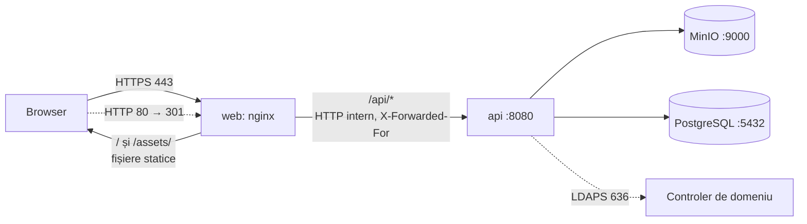

# SGDM - instalare, publicare și backup

Document pentru **cine instalează și administrează** platforma. Pentru ce face
sistemul și de ce a fost proiectat astfel: [`README.md`](../README.md).

Toate comenzile se rulează din rădăcina repository-ului. Pe Windows sunt scrise
pentru PowerShell, fiecare pe un singur rând.

---

## Cuprins

1. [Cele două moduri de rulare](#1-cele-două-moduri-de-rulare)
2. [Cerințe](#2-cerințe)
3. [Modul de dezvoltare](#3-modul-de-dezvoltare)
4. [Totul în Docker, cu HTTPS](#4-totul-în-docker-cu-https)
5. [Certificatul TLS](#5-certificatul-tls)
6. [Ce este expus în rețea](#6-ce-este-expus-în-rețea)
7. [Baza de date](#7-baza-de-date)
8. [Backup și restaurare](#8-backup-și-restaurare)
9. [Actualizarea la o versiune nouă](#9-actualizarea-la-o-versiune-nouă)
10. [Probleme frecvente](#10-probleme-frecvente)
11. [Lista de verificare înainte de producție](#11-lista-de-verificare-înainte-de-producție)

---

## 1. Cele două moduri de rulare

| | Dezvoltare | Totul în Docker |
|---|---|---|
| Frontend | `npm run dev` (Vite, port 5173) | imaginea `web`: nginx, fișiere statice |
| API | `dotnet run` (port 5000) | imaginea `api`, fără port pe gazdă |
| HTTPS | nu | da, terminat în nginx (porturile 80/443) |
| MinIO | Docker, `127.0.0.1:9000` | Docker, aceeași instanță |
| PostgreSQL | Docker, `127.0.0.1:5432` | Docker, aceeași instanță |
| Adresa aplicației | `http://localhost:5173` | `https://sgdm.local` (configurabil) |
| Când | scrii cod | demonstrație, server, orice acces din rețea |

Ambele citesc **același `.env`**. Diferențele sunt izolate în variabile separate
(`FRONTEND_ORIGIN` pentru dezvoltare, `SGDM_PUBLIC_ORIGIN` pentru Docker;
`DB_CONNECTION_STRING` spre `localhost`, iar containerele își construiesc
singure conexiunea spre `postgres`; `LDAP_CA_FILE` și `LDAP_CONTAINER_CA_FILE`),
ca să nu fie nevoie de editări la trecerea dintr-un mod în altul.

---

## 2. Cerințe

- **Docker Desktop** (Windows/macOS) sau Docker Engine + plugin-ul Compose v2
  (Linux). Verificare: `docker compose version`.
- Pentru modul de dezvoltare, în plus: **.NET 8 SDK** și **Node.js 22**.
- Pentru migrări: `dotnet tool install --global dotnet-ef`.
- Nimic pentru baza de date: PostgreSQL 17 rulează în Docker (serviciul
  `postgres`). O instalare pe Windows nu e necesară.

---

## 3. Modul de dezvoltare

```powershell
Copy-Item .env.example .env
```

Completați în `.env` secretele (`MAI_JWT_KEY`, `MAI_ARGON2_PEPPER`,
`MAI_TWOFACTOR_KEY`, `MAI_STORAGE_MASTER_KEYS`, parola MinIO), apoi
`POSTGRES_PASSWORD` și aceeași parolă în `DB_CONNECTION_STRING`. Fiecare secret
se generează separat:

```powershell
docker run --rm alpine/openssl rand -base64 48
```

Parola bazei, doar litere și cifre (ajunge într-un connection string):

```powershell
-join ((48..57)+(65..90)+(97..122) | Get-Random -Count 32 | ForEach-Object {[char]$_})
```

Apoi, fiecare în terminalul lui:

```powershell
docker compose up -d postgres minio minio-init
```
```powershell
dotnet ef database update --project MAI.DataAccessLayer --startup-project MAI.Api
```
```powershell
dotnet run --project MAI.Api
```
```powershell
cd frontend; npm ci; npm run dev
```

Aplicația: <http://localhost:5173>. Swagger (doar în Development):
<http://localhost:5000/swagger>.

---

## 4. Totul în Docker, cu HTTPS

### 4.1 Configurare

Pe lângă secretele din secțiunea 3, în `.env`:

| Variabilă | Implicit | Rol |
|---|---|---|
| `SGDM_SERVER_NAME` | `sgdm.local` | Numele DNS al aplicației; trebuie să fie în certificat |
| `SGDM_PUBLIC_ORIGIN` | `https://sgdm.local` | Adresa completă: linkuri din email, redirecționarea HTTP → HTTPS |
| `SGDM_HTTP_PORT` / `SGDM_HTTPS_PORT` | `80` / `443` | Porturile publicate pe gazdă |
| `SGDM_SELF_SIGNED` | `true` | Generează un certificat autosemnat dacă lipsește cel real |
| `SGDM_DOCKER_SUBNET` / `SGDM_PROXY_IP` | `172.28.0.0/24` / `172.28.0.10` | Rețeaua internă și IP-ul fix al nginx |
| `POSTGRES_PASSWORD` | - | Parola bazei din Docker; conexiunea containerelor se construiește din ea |
| `DB_CONTAINER_CONNECTION_STRING` | gol | Doar pentru o bază externă, în locul serviciului `postgres` |
| `INTRANET_ONLY` / `INTRANET_AUDIT_ONLY` | `false` / `false` | Acces doar din rețele private, pe IP-ul real al clientului; modul doar-jurnal |
| `TWOFACTOR_REQUIRED_PRIVILEGED` | `false` | 2FA obligatoriu pentru Administrator și Șef de direcție |

> Containerul nu vede user-secrets și nici `appsettings.Development.json`.
> Dacă până acum ați rulat API-ul cu secretele acolo, copiați **exact** aceleași
> valori în `.env`.
> Un `MAI_ARGON2_PEPPER` diferit invalidează toate parolele; o
> `MAI_TWOFACTOR_KEY` diferită face ilizibile secretele 2FA; o cheie din
> `MAI_STORAGE_MASTER_KEYS` lipsă face ilizibile documentele criptate cu ea.

Baza de date nu cere nicio configurare în plus: API-ul din container se
conectează la serviciul `postgres` cu aceleași `POSTGRES_*` din `.env`. Pentru
datele existente pe Supabase: secțiunea 7.3.

### 4.2 Numele aplicației

Numele trebuie să se rezolve pe stațiile utilizatorilor. În instituție: o
înregistrare în DNS-ul intern. Pentru demonstrație pe aceeași mașină, o linie
în `C:\Windows\System32\drivers\etc\hosts`:

```
127.0.0.1 sgdm.local
```

Scriptul din secțiunea 5.2 o poate adăuga automat.

### 4.3 Pornire

La prima pornire după această versiune, rețeaua Docker veche (fără subrețea
fixă) trebuie recreată. `down` fără `-v` păstrează datele:

```powershell
docker compose down
```
```powershell
docker compose up -d --build
```

Ordinea de pornire e impusă prin `depends_on`: PostgreSQL și MinIO sănătoase →
`minio-init` (bucket, versionare, retenție) → API sănătos → web. Starea:

```powershell
docker compose ps
```

Toate serviciile permanente trebuie să apară `healthy`; `minio-init` apare
`exited (0)`, e normal. Aplicația: <https://sgdm.local>.

Verificare rapidă, din PowerShell:

```powershell
curl.exe -k https://sgdm.local/api/health
```

### 4.4 Cum circulă o cerere



Browserul vede o singură origine. De aici decurg trei lucruri:

- **CORS nu mai intervine**: pagina și `/api` au aceeași origine.
- **CSP poate fi strictă**: `connect-src 'self'`, fără `localhost` și porturi.
  Nginx o trimite ca antet HTTP, pe lângă cea din `<meta>`; browserul le aplică
  pe amândouă, deci antetul poate doar înăspri. În plus, `frame-ancestors` are
  efect doar ca antet.
- **Cifrotextul transferurilor trece prin API** (`/api/Transfers/{id}/content`),
  nu prin URL-uri presemnate MinIO (`Storage__UsePresignedDownload=false`):
  numele `minio` există doar în rețeaua Docker, iar browserul nu l-ar putea
  rezolva.

### 4.5 Ce face nginx, pe scurt

Configurația completă, comentată: [`frontend/nginx/default.conf.template`](../frontend/nginx/default.conf.template).

| Decizie | Motiv |
|---|---|
| HTTP → HTTPS spre `SGDM_PUBLIC_ORIGIN`, nu spre `$host` | Altfel, `Host: atacator.example` ar produce o redirecționare deschisă pe numele instituției |
| TLS 1.2 + 1.3, doar suite AEAD cu ECDHE | Profilul Mozilla „intermediate”; forward secrecy |
| `ssl_session_tickets off` | Cheia tichetelor ar permite decriptarea retroactivă a sesiunilor reluate |
| `X-Forwarded-For $remote_addr` (suprascris, nu adăugat) | Un client nu își poate falsifica IP-ul ca să ocolească rate limit-ul sau filtrul de intranet |
| `client_max_body_size 52m` | Oprește cererile uriașe înainte de API; plafonul real rămâne în API (51 MB) |
| `proxy_request_buffering off` | Încărcarea merge direct la API; cifrotextul nu rămâne în fișiere temporare ale proxy-ului |
| `gzip off` pe `/api/` | Răspunsurile combină secrete cu date controlate de utilizator: condiția atacului BREACH |
| Upstream prin variabilă + `resolver` | Nginx pornește chiar dacă API-ul întârzie și urmărește IP-ul nou după o recreare a containerului |
| `index.html` fără cache, `/assets/` cache un an | Fișierele din `/assets/` au hash în nume; după o actualizare, utilizatorii primesc imediat versiunea nouă |

### 4.6 IP-ul real al clientului

API-ul are încredere în antetul `X-Forwarded-For` **doar** când cererea vine de
la IP-ul fix al containerului web (`RateLimit__KnownProxies__0 =
SGDM_PROXY_IP`). De aceea web are adresă fixă, într-o subrețea fixă: o listă de
rețele întregi ar fi însemnat încredere în orice container din rețea.

Fără această configurare, toate cererile ar părea să vină de la nginx: un
singur utilizator care greșește parola de zece ori ar bloca autentificarea
pentru toată instituția, iar jurnalul de audit ar arăta același IP pentru toți.

---

## 5. Certificatul TLS

### 5.1 Unde stă

`./certs/tls/tls.crt` și `./certs/tls/tls.key` pe gazdă, montate în containerul
web. Directorul e în `.gitignore`.

La pornire, [`frontend/nginx/15-sgdm-tls.sh`](../frontend/nginx/15-sgdm-tls.sh):

| Situație | Rezultat |
|---|---|
| Ambele fișiere există | Folosite neatinse; avertisment în log dacă expiră în sub 30 de zile |
| Lipsesc ambele, `SGDM_SELF_SIGNED=true` | Se generează unul autosemnat (ECDSA P-256, 397 de zile) pentru `SGDM_SERVER_NAME` și se păstrează |
| Lipsesc ambele, `SGDM_SELF_SIGNED=false` | Containerul **nu pornește** |
| Există doar unul | Containerul nu pornește (probabil o copiere incompletă; nu se suprascrie o cheie reală) |

### 5.2 Demonstrație: certificatul autosemnat, de încredere pe Windows

După prima pornire:

```powershell
.\scripts\trust-dev-cert.ps1
```

Importă certificatul în `Cert:\CurrentUser\Root` (fără drepturi de
administrator; Windows cere confirmare) și verifică fișierul hosts. Pentru a
adăuga și linia din hosts, dintr-un PowerShell pornit ca Administrator:

```powershell
.\scripts\trust-dev-cert.ps1 -AddHostsEntry
```

Certificatul generat are `CA:FALSE` și `extendedKeyUsage=serverAuth`: chiar
importat ca rădăcină, nu poate semna certificate pentru alte site-uri.
Scoaterea: `.\scripts\trust-dev-cert.ps1 -Remove`.

Dacă schimbați `SGDM_SERVER_NAME`, certificatul vechi nu mai corespunde.
Ștergeți `certs\tls\tls.crt` și `tls.key`, apoi `docker compose restart web`.

### 5.3 Producție: certificatul instituției

1. Cereți de la CA-ul intern un certificat de server pentru numele aplicației
   (în **subjectAltName**, nu doar în CN).
2. Copiați-l ca `certs/tls/tls.crt` (certificatul serverului urmat de
   intermediari, în format PEM) și cheia ca `certs/tls/tls.key`.
3. În `.env`: `SGDM_SELF_SIGNED=false`.
4. `docker compose restart web` și verificați în log linia `Certificat existent`.

Stațiile au deja CA-ul instituției (distribuit prin politica de grup), deci nu
e nevoie de niciun import manual.

---

## 6. Ce este expus în rețea

| Port pe gazdă | Serviciu | Accesibil din |
|---|---|---|
| 80, 443 | web (nginx) | rețea |
| 9000, 9001 | MinIO (S3 și consola) | doar gazda (`127.0.0.1`) |
| 5432 | PostgreSQL | doar gazda (`127.0.0.1`) |
| - | api | doar rețeaua Docker (prin nginx) |
| 389, 636, 3268, 3269 | Samba AD (profilul `ldap`) | rețea; **doar laborator** |

API-ul nu mai are port pe gazdă: un port deschis direct ar ocoli TLS, antetele
de securitate și limita de mărime din nginx. MinIO și PostgreSQL ascultă doar
local: API-ul pornit cu `dotnet run` și clienții de baze de date le găsesc pe
`localhost`, un alt calculator din LAN nu le vede.

Consola MinIO, de pe gazdă: <http://localhost:9001>.

---

## 7. Baza de date

### 7.1 Unde stă și cum o vezi

PostgreSQL 17 rulează în containerul `sgdm-postgres`, cu datele în volumul
Docker `pg-data`. `docker compose down` le păstrează; doar `down -v` le șterge.

Ascultă doar pe `127.0.0.1:5432` (portul se schimbă cu `POSTGRES_HOST_PORT`).
Pentru a o vedea în detaliu, orice client PostgreSQL de pe mașina gazdă:

| Câmp | Valoare |
|---|---|
| Host / Port | `localhost` / `5432` |
| Bază | `POSTGRES_DB` din `.env` (implicit `sgdm`) |
| Utilizator / parolă | `POSTGRES_USER` / `POSTGRES_PASSWORD` din `.env` |
| SSL | dezactivat (conexiune doar locală) |

În DataGrip / Rider: Database → + → Data Source → PostgreSQL. În DBeaver: New
Connection → PostgreSQL. Tabelele aplicației sunt în schema `public`.

Din linia de comandă, fără nimic instalat:

```powershell
docker exec -it sgdm-postgres psql -U sgdm -d sgdm
```

(`\dt` listează tabelele, `\d "Users"` descrie un tabel, `\q` iese.)

### 7.2 Migrările

API-ul **nu aplică migrările la pornire**, intenționat: o schimbare de schemă pe
o bază de producție se face conștient, de un om, nu ca efect secundar al unui
`docker compose up`. Înainte de orice migrare: un backup (secțiunea 8).

```powershell
dotnet ef database update --project MAI.DataAccessLayer --startup-project MAI.Api
```

Comanda citește `DB_CONNECTION_STRING` din `.env` (prin `DotEnvLoader`), adică
`localhost:5432`, aceeași bază pe care o folosește și containerul API.

Starea migrărilor aplicate:

```powershell
dotnet ef migrations list --project MAI.DataAccessLayer --startup-project MAI.Api
```

### 7.3 Mutarea datelor de pe Supabase

Până la 22 septembrie 2026, baza stătea pe Supabase. Mutarea se face o
singură dată, cu un script care folosește imaginea de backup:

```powershell
.\scripts\migrate-db-to-docker.ps1
```

Ce face, oprindu-se la prima eroare fără să modifice `.env`:

1. verifică: niciun API pornit (scrierile din timpul mutării s-ar pierde),
   `POSTGRES_PASSWORD` (o generează dacă lipsește), sursa accesibilă;
2. pornește `postgres` și așteaptă să fie sănătos;
3. face backup **doar al bazei** din Supabase, în `.\backups` (rămâne acolo ca
   punct de revenire);
4. îl restaurează local cu `--skip-policies`: politicile RLS de pe Supabase
   sunt scrise pentru rolurile platformei (`anon`, `authenticated`), care aici
   nu există, iar aplicația nu folosește RLS;
5. compară numărul **exact** de rânduri din fiecare tabel, sursă și destinație;
6. doar dacă totul corespunde, rescrie `DB_CONNECTION_STRING` spre
   `localhost` și păstrează vechea valoare în `SUPABASE_CONNECTION_STRING`,
   cu o copie a fișierului în `.env.bak-<data-ora>`.

Sursa implicită e `DB_CONNECTION_STRING` din `.env`. Conexiunea directă Supabase
(`db.<proiect>.supabase.co`) are doar IPv6, pe care containerele nu îl au;
scriptul o refuză și cere varianta **Session pooler** (Settings → Database →
Connection string, port 5432):

```powershell
.\scripts\migrate-db-to-docker.ps1 -Source "Host=aws-0-....pooler.supabase.com;Port=5432;Database=postgres;Username=postgres.<proiect>;Password=...;SSL Mode=Require"
```

Fișierele din MinIO nu se mută: rămân în același bucket, iar rândurile din
bază le referă exact ca înainte. Revenirea: valoarea din
`SUPABASE_CONNECTION_STRING` copiată în `DB_CONNECTION_STRING` (pentru
`dotnet run`) sau în `DB_CONTAINER_CONNECTION_STRING` (pentru Docker).

---

## 8. Backup și restaurare

### 8.1 Ce se salvează

```powershell
docker compose --profile backup run --rm backup
```

Rezultatul, în `./backups/<AAAALLZZ-HHMMSS>/`:

| Fișier | Conținut |
|---|---|
| `database.dump` sau `database.dump.gpg` | `pg_dump`, format custom, schema aplicației (`public`) |
| `storage/` | copia bucketului MinIO (versiunile curente ale obiectelor) |
| `MANIFEST.txt` | când, de unde, câte tabele și obiecte, id-ul cheii de stocare active |
| `SHA256SUMS` | sumele tuturor fișierelor de mai sus |

Un backup se scrie într-un director temporar (`.incomplete-...`) și primește
numele final doar la sfârșit. Un backup întrerupt nu arată niciodată ca unul
complet, iar restaurarea refuză orice director fără `SHA256SUMS`.

Backupul folosește **aceeași** conexiune ca API-ul din container (serviciul
`postgres` sau `DB_CONTAINER_CONNECTION_STRING`). Un backup făcut dintr-o altă
bază decât cea pe care rulează aplicația arată bine până în ziua în care e
nevoie de el.

### 8.2 Cifrarea și cheile

Ce e deja cifrat, fără nicio configurare:

- `storage/transfers/` - E2EE, cifrat în browser; nici serverul nu îl poate citi;
- `storage/documents/`, `storage/internal/` - cifrate de API cu cheia principală
  (`MAI_STORAGE_MASTER_KEYS`), vezi [`STORAGE-ENCRYPTION.md`](STORAGE-ENCRYPTION.md).

Dump-ul bazei conține hashuri Argon2id (pepper-ul e în afara bazei), cheile
private E2EE (cifrate cu parola fiecărui utilizator), secretele TOTP (cifrate
cu `MAI_TWOFACTOR_KEY`), numele fișierelor și întreg jurnalul de audit. Nimic
direct exploatabil, dar o hartă completă a cine cu cine comunică. Cu
`BACKUP_PASSPHRASE` setat în `.env`, dump-ul se cifrează cu gpg (AES-256).

**Backupul nu conține nicio cheie, intenționat.** Pentru restaurare sunt
necesare, din afara directorului de backup:

| Cheie | Fără ea |
|---|---|
| `MAI_STORAGE_MASTER_KEYS` (toate id-urile folosite) | documentele normative și interne nu se mai pot citi |
| `MAI_ARGON2_PEPPER` | nicio parolă locală nu mai funcționează |
| `MAI_TWOFACTOR_KEY` | 2FA trebuie resetat pentru toți |
| `MAI_JWT_KEY` | doar sesiunile active se pierd (se poate genera alta) |
| `BACKUP_PASSPHRASE` | dump-ul cifrat nu se mai poate deschide |

Păstrați-le **în afara serverului** (seif de parole al instituției, plic sigilat
în seif), separat de copiile backupului. Un backup restaurabil doar cu ceva ce
stă pe același disc nu apără de pierderea discului; unul care își poartă
cheile cu el nu e cifrat.

### 8.3 Programare

Windows, zilnic la 02:00 (Task Scheduler, o singură comandă; înlocuiți calea):

```powershell
schtasks /Create /TN "SGDM Backup" /SC DAILY /ST 02:00 /TR "cmd /c cd /d C:\cale\spre\mai-secure-platform && docker compose --profile backup run --rm backup >> backups\backup.log 2>&1"
```

Linux (`crontab -e`):

```
0 2 * * * cd /opt/sgdm && docker compose --profile backup run --rm backup >> /var/log/sgdm-backup.log 2>&1
```

Retenția: backupurile mai vechi de `BACKUP_RETENTION_DAYS` (implicit 14) se
șterg la fiecare rulare. Se șterg doar directoare cu numele în formatul generat
de script; orice altceva din `./backups` rămâne neatins. `0` = fără ștergere.

**Copia din afara serverului** rămâne în sarcina administratorului (robocopy
spre un share de rețea, bandă, disc extern). Un backup care stă doar pe
serverul pe care îl protejează nu supraviețuiește pierderii acelui server.

### 8.4 Verificare și restaurare

```powershell
docker compose --profile backup run --rm backup list
```
```powershell
docker compose --profile backup run --rm backup verify 20260921-020000
```

Restaurarea verifică întâi sumele SHA-256 și refuză să continue fără `--yes`:

```powershell
docker compose stop api
```
```powershell
docker compose --profile backup run --rm backup restore 20260921-020000 --yes
```
```powershell
docker compose start api
```

Opțiuni: `--database-only`, `--storage-only`, `--skip-policies` (omite
politicile RLS, pentru dump-uri venite de pe Supabase).

Numărul exact de rânduri din fiecare tabel, util după o restaurare:

```powershell
docker compose --profile backup run --rm backup counts
```

Comportamentul, pe scurt:

- baza se restaurează **într-o singură tranzacție**: dacă ceva eșuează, baza
  rămâne exact cum era, nu pe jumătate restaurată;
- tabelele din backup se înlocuiesc; tabelele create **după** backup (de o
  migrare mai nouă) rămân în bază. După restaurarea unui backup mai vechi decât
  ultima migrare, rulați `dotnet ef database update`; dacă migrarea se plânge
  că un tabel există deja, ștergeți manual tabelele adăugate de ea;
- stocarea: obiectele din backup se rescriu; obiectele apărute după backup
  rămân. Nu sunt referite din baza restaurată, deci nu apar nicăieri, iar
  jobul de expirare le curăță pe cele de transfer. Ștergerea automată ar fi
  ireversibilă dacă s-a ales din greșeală un backup vechi.

**Un backup nerestaurat niciodată nu e un backup.** CI-ul face la fiecare push
un backup și o restaurare completă pe o bază și un MinIO efemere (jobul
`docker` din `.github/workflows/ci.yml`). Pe serverul real, repetați periodic o
restaurare pe o mașină de test.

### 8.5 Limitări cunoscute

- Parola bazei nu poate conține `;` sau ghilimele (connection string-ul Npgsql
  e tradus în variabile `PG*`; scriptul detectează cazul și se oprește).
- Pentru o sursă Supabase, doar pooler-ul în mod **Session** (port 5432)
  suportă `pg_dump`; modul Transaction (6543) nu.
- `pg_dump` din imagine este versiunea 17. Pentru un server mai nou:
  `docker compose build --build-arg PG_MAJOR=18 backup`.
- Se salvează doar versiunea curentă a fiecărui obiect din MinIO, nu și
  versiunile vechi (care oricum expiră după o zi).

---

## 9. Actualizarea la o versiune nouă

```powershell
git pull
```
```powershell
docker compose --profile backup run --rm backup
```
```powershell
dotnet ef database update --project MAI.DataAccessLayer --startup-project MAI.Api
```
```powershell
docker compose up -d --build
```

Imaginea web se reconstruiește cu frontend-ul nou; `index.html` nu e ținut în
cache, deci utilizatorii primesc versiunea nouă la următoarea încărcare a
paginii, fără golirea manuală a cache-ului.

---

## 10. Probleme frecvente

| Simptom | Cauză probabilă | Rezolvare |
|---|---|---|
| `network ... needs to be recreated` la `up` | Rețeaua veche, fără subrețea fixă | `docker compose down` (fără `-v`), apoi `up` |
| `Pool overlaps with other one on this address space` | `172.28.0.0/24` e folosită deja | Altă subrețea în `SGDM_DOCKER_SUBNET` și `SGDM_PROXY_IP` în ea |
| `web` rămâne `starting` | API-ul nu e `healthy` | `docker compose logs api`: de obicei un secret-șablon sau conexiunea la bază |
| API: `placeholder` / `SCHIMBA_MA` la pornire | Un secret din `.env` a rămas pe valoarea-șablon | Generați-l (secțiunea 3) |
| Browserul: `NET::ERR_CERT_AUTHORITY_INVALID` | Certificat autosemnat neimportat | `.\scripts\trust-dev-cert.ps1`, apoi reporniți browserul |
| Browserul: `ERR_CERT_COMMON_NAME_INVALID` | `SGDM_SERVER_NAME` schimbat după generarea certificatului | Ștergeți `certs\tls\*`, `docker compose restart web` |
| `sgdm.local` nu se deschide deloc | Lipsește linia din hosts / DNS | Secțiunea 4.2 |
| Portul 80 sau 443 ocupat | IIS, alt server web | `SGDM_HTTP_PORT=8080`, `SGDM_HTTPS_PORT=8443` și portul în `SGDM_PUBLIC_ORIGIN` |
| Toți utilizatorii primesc 429 după câteva greșeli | IP-ul real nu ajunge la API | `SGDM_PROXY_IP` trebuie să fie IP-ul serviciului web: `docker inspect sgdm-web` |
| Linkurile din email duc la `localhost:5173` | API-ul din Docker folosește `SGDM_PUBLIC_ORIGIN` | Verificați valoarea în `.env` și `docker compose up -d api` |
| Login de domeniu eșuează doar în Docker | `LDAP_CA_FILE` e o cale Windows | `LDAP_CONTAINER_CA_FILE=/app/certs/ad-ca.pem` (vezi [`LDAP-AD.md`](LDAP-AD.md)) |
| `postgres` nu pornește: port 5432 ocupat | Un PostgreSQL instalat pe Windows | `POSTGRES_HOST_PORT=5433` și același port în `DB_CONNECTION_STRING` |
| `password authentication failed` după schimbarea `POSTGRES_PASSWORD` | Parola se aplică doar la prima inițializare a volumului | Reveniți la parola veche sau o schimbați în bază: `ALTER USER sgdm PASSWORD '...'` |
| Migrarea: sursa refuzată sau `pg_dump a esuat` | Conexiune directă Supabase (IPv6) sau pooler Transaction (6543) | Session pooler, port 5432 (secțiunea 7.3) |
| Backup: `server version mismatch` | Server PostgreSQL mai nou decât pg_dump 17 | `docker compose build --build-arg PG_MAJOR=18 backup` |
| Script `.sh`: `not found` în container | Fișier cu CRLF | Imaginile convertesc automat; pentru Git, `.gitattributes` forțează LF |

Loguri, filtrate după nivel (JSON, o linie per eveniment):

```powershell
docker compose logs --tail 200 api
```

---

## 11. Lista de verificare înainte de producție

- [ ] Toate secretele generate, niciunul pe valoarea-șablon (API-ul refuză oricum să pornească), inclusiv `POSTGRES_PASSWORD`
- [ ] Cheile (`MAI_STORAGE_MASTER_KEYS`, `MAI_ARGON2_PEPPER`, `MAI_TWOFACTOR_KEY`, `BACKUP_PASSPHRASE`) copiate în afara serverului
- [ ] Certificatul instituției în `certs/tls/`, `SGDM_SELF_SIGNED=false`
- [ ] `SGDM_SERVER_NAME` în DNS-ul intern; `SGDM_PUBLIC_ORIGIN` corect (linkurile din email)
- [ ] `INTRANET_ONLY=true`, după o zi cu `INTRANET_AUDIT_ONLY=true` și jurnalul verificat
- [ ] `STORAGE_ENCRYPTION_ALLOW_PLAINTEXT=false`, după `storage:recrypt` fără erori
- [ ] `TWOFACTOR_REQUIRED_PRIVILEGED=true`, după ce administratorii și-au activat 2FA
- [ ] Backup programat, copiat în afara serverului, **o restaurare de probă reușită**
- [ ] Porturile 9000/9001 neexpuse în afara gazdei (implicit așa sunt)
- [ ] Samba AD de laborator oprit; `LDAP_HOST` spre controlerul de domeniu real, cu LDAPS
- [ ] Imaginile `minio/minio` și `minio/mc` fixate pe o versiune exactă în `docker-compose.yml`
